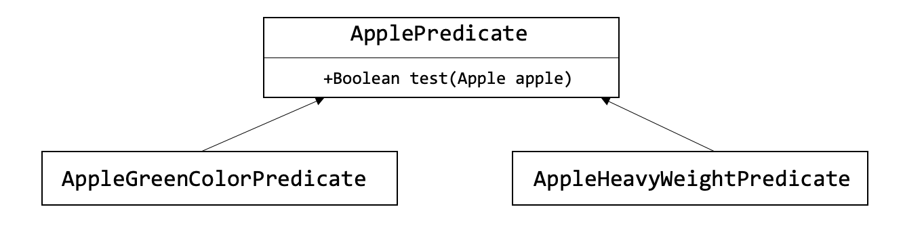

# 동작 파라미터화 코드전달하기
* 변화하는 요구사항에 대응
* 동작파라미터화
* 익명클래스
* 람다 표현식 미리보기
* 실전예제

### 동작파라미터화를 이용하면 자주바뀌는 요구사항에 효과적으로 대응할 수있다.
동작 파라미터화란 아직은 어떻게 실행할 것인지 결정하지 않은 코드블록을 의미한다. 이 코드블록의 실행은 나중으로 미뤄진다. 결과적으로 코드블록에 따라 메서드의 동작이 파라미터화 된다. 

## 2.1.1 첫번째 시도: 녹색사과 필터링
사과 색을 정의하는 Color num이 존재한다고 가정했을때,
~~~java
enum Color {RED, GREEN}
~~~
* enum 이란?  
Enum은 열거형이라고 불리며, 서로 연관된 상수들의 집합을 의미하며,
기존에 상수를 정의하는 방법이였던 final static string 과 같이 문자열이나 숫자들을 나타내는 기본자료형의 값을 enum을 이용해서 같은 효과를 낸다.  

첫번째 시도한 코드는 녹색사과를 선택하는 데 필요한 조건을 가리킨다. 그런데 요구사항이 변화하며, **빨간** 사과도 필터링하게되었다. 이것을 고치려면 if문의 조건을 빨간사과로 바꾸는 선택을 할 수 있지만, 나중에 더 다양한 색 으로 필터링하는 등의 변화에는 적절하게 대응 할 수 없다.  

## 2.1.2 두번째 시도: 색을 파라미터화 
녹색사과뿐만아니라 다른색의 사과를 필터링할때 코드를 반복사용하지않고, 구현하기 위해서 메서드에 색을 파라미터화할수 있도록 메서드에 파라미터를 추가하면 변화하는 요구사항에 유연하게 대응하는 코드를 만들 수 있다. 또한 무게기준도 얼마든지 바뀔수 있다. 
~~~java
List<Apple> redApples = filterApplesByColor(inventory, Color.RED);

List<Apple> heavyApples = filterApplesByWeight(inventory, 100);
~~~
위 두 코드도 좋은 해결책이지만 <a href= "https://github.com/day0ung/TIL-ModernJavaInAction/blob/main/java_code/modern_java/src/chapter02/SourceCode021.java" >구현 코드 2.1.2 </a> 를 보면, 대부분 중복된다.  
이는 소프트웨어 공학의 DRY don't repeat yourself (같은것을 반복하지 말것) 원칙을 어기는 것이다.  

## 2.1.3 세번째 시도: 가능한 모든 속성으로 필터링
실전에서는 절대로 사용하지 말아야하는 코드, <a href= "https://github.com/day0ung/TIL-ModernJavaInAction/blob/main/java_code/modern_java/src/chapter02/SourceCode021.java" >구현 코드 2.1.3 </a>

~~~java
List<Apple> greenApples2 = filterApples(inventory, Color.GREEN, 0 ,true);
List<Apple> heavyApples2 = filterApples(inventory, null, 150 ,false);
~~~
true와 false는 뭘 의미하는지, 앞으로 요구사항이 바뀌었을대 유연하게 대응할수도 없다. 예를들어 사과의 크기,모양, 출하지 등으로 필터링하고 싶다면..? filterApples에 어떤 기준으로 사과를 필터링할 것인지 효과적으로 전달할 수 있다면 더 좋을것이다.

## 2.2 동작파라미터화
2.1절에서 파라미터를 추가하는 방법이 아닌 변화하는 요구사항에 유연하게 대응할 수 있는방법이 절실하다는 것을 확인했다.   
사과의 어떤 속성에 기초해서 boolean값을 반환(예를들어 사과가 녹색인가? 150그램이상인가?)하는 방법이 있다. 참 또는 거짓을 반환하는 함수를 **프레디케이트** 라고 한다. **선택조건을 결정하는 인터페이스**를 정의하자  
~~~java
public interface ApplePredicate {
    boolean test(Apple apple);
}
// 다양한 선택조건을 대표하는 여러버전의 ApplePredicate를 정의할 수 있다.
class AppleHeavyWeightPredicate implements  ApplePredicate { .. }
class AppleGreenColorPredicate implements  ApplePredicate { .. }
~~~
동작에 따라 filter메서드가 다르게 동작할 것이라고 예상할수 있다.  

이를 **전략 디자인 패턴 strategy design pattern** 이라한다.
* 전략디자인 패턴은 각 알고리즘을 캡슐화 하는 알고리즘 팸리리를 정의해둔 다음에 런타임에 알고리즘을 선택하는 기법이다.  

## 2.2.1 네번째 시도: 추상적 조건으로 필터링
<a href= "https://github.com/day0ung/TIL-ModernJavaInAction/blob/main/java_code/modern_java/src/chapter02/SourceCode022.java" >구현 코드 2.2.1 </a>  
위코드로 2.1.에서 구현한 코드에 비해 더 유연한 코드를 얻었으며 가독성도 좋아졌다.  
예를들어 무게가 150그램이 넘는 빨간 사과를 검색해달라고 부탁하면 우리는 ApplePredicate를 구현하는 클래스만 만들면된다. 우리가 전달한 ApplePredicate객체에 의해 filterApples 메서드의 동작이 결정된다. 즉, 우리는 filterApples의 동작을 파라미터 화 한것이다.  
~~~java
public class AppleRedAndHeavyPredicate implements ApplePredicate{
    public boolean test(Apple apple){
        return "red".equals(apple.getColor()) && apple.getWeight() >  150;
    }
}
//return 하는 부분을 인자로 전달
filterApple(inventory,  /*d인자*/);
~~~
> 퀴즈(2-1) 
사과 리스트를 인수로 받아 다양한 방법으로 문자열을 생성  
<a href= "https://github.com/day0ung/TIL-ModernJavaInAction/blob/main/java_code/modern_java/src/chapter02/SourceCode022.java" >구현 코드 2.2.1 - 퀴즈 (2-1) </a>  

## 2.3.2 다섯번째 시도: 익명클래스 사용
2.2에서 한 구현방법은 여러 클래스를 정의한 다음에 인스턴스화 해야한다.   
**익명클래스** 는 자바의 지역클래스(블록낸부에 선언된 클래스)와 비슷한 개념이다. 익명클래스는 말 그대로 이름이 없는 클래스이다.  
익명클래스를 이용하면 *클래스 선언과 인스턴스화를 동시*에 할수 있다.  
~~~java
List<Apple> redApples = filterApples(inventory, new ApplePredicate() { <- filterApples의 메서드 동작을 직접파라미터화
            @Override
            public boolean test(Apple a) {
                return Color.RED.equals(a.getColor());
            }
        });
~~~

## 2.3.3 여섯번째 시도: 람다 표현식 사용
~~~java
List<Apple> result = filterApples(inventory, (Apple apple) -> Color.RED.equals(apple.getColor()));
~~~

## 2.3.4 일곱번째 시도: 리스트형식으로 추상화
~~~java
public interface Predicate<T> {boolean test(T t)};

public static <T> List<T> filter(List<T> list, Predicate<T> p ){
    List<T> result = new ArrayList<>();
    for(T e: list){
        if(p.test(e)){
            result.add(e);
        }
    }
    return result;
}
~~~
이제 AppleClass에 국한되지 않고 다양한 변수를 받을수 있게되었다.

## 동작파라미터화 요약
*  클래스를 통한 동작 파라미터화
~~~java
public interface ApplePredicate
public class AppleGreenColorPredicate implements ApplePerdicate {
	public boolean test(Apple apple) {
		return GREEN.equals(apple.getColor());
	}
}

List<Apple> greenApples = filterApples(inventory, new AppleGreenColorPredicate());
~~~

*  익명 클래스를 통한 동작 파라미터화
~~~java
List<Apple> redApples = filterApples(inventory, new ApplePredicate() { 
            @Override
            public boolean test(Apple a) {
                return Color.RED.equals(a.getColor());
            }
        });
~~~
*  람다를 통한 동작 파라미터화
~~~java
List<Apple> result = filterApples(inventory, (Apple apple) -> Color.RED.equals(apple.getColor()));
~~~
---
 자바 API의 많은 메서드는 정렬, 스레드, GUI 처리 등을 포함한 다양한 동작으로 파라미터화 할 수 있다.
~~~java
// ex) java.util.Comparator
public interface Comparator<T> {
	int compare(T o1, T o2)l
}

// anonymous class
inventory.sort(new Comparator<Apple>() {
	public int compare(Apple a1, Apple a2) {
		return a1.getWeight().compareTo(a2.getWeight());
	}
});

// lamda
inventory.sort(
	(Apple a1, Apple a2) -> a1.getWeight().compareTo(a2.getWeight()));
~~~
