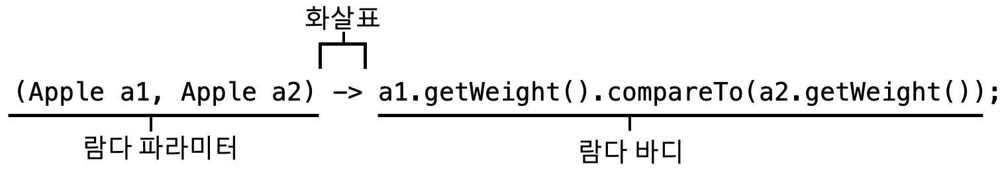

# 람다 표현식
## 3.1 람다란 무엇인가?
**람다표현식**은 메서드로 전달할수 있는 익명함수를 단순화한것이다
 * 익명 : 보통의 메서드와 달리 이름이 없으므로 익명이라 표현한다. 구형해야 할 코드에 대한 걱정거리가 줄어든다
 * 함수 : 람다는 메서드처럼 특정 클래스에 종속되지 않으므로 함수라고 부른다. 하지만 메서드처럼 파라미터 리스트, 바디, 반환 형식, 가능한 예외 리스트를 포함한다.
 * 전달 : 람다 표현식을 메서드 인수로 전달하거나 변수로 저장할 수 있다.
 * 간결성 : 익명 클래스처럼 많은 자질구레한 코드를 구현할 필요가 없다.

 예시)
 ~~~java
 //기존코드
 Comparator<Apple> byWeight = new Comparator<Apple>{
    public int compare(Apple a1, Apple a2){
        return a1.getWeight().comareTo(a2.getWeight());
    }
 }

 //람다코드
 Compare<Apple> byWeight = (Apple a1, Apple a2) -> a1.getWeight().compareTo(a2.getWeight());
 ~~~

 * 파라미터 리스트 : Comparetor의 compare메서드 파타미터(사과두개)
 * 화살표 : 화살표(->)는 람다의 파라미터와 바디를 구분한다
 * 람다 바디 : 두 사과의 무게를 비교한다. 람다의 반환값에 해당하는 표현식

 ## 3.2 어디에, 어떻게 람다를 사용할까?
 * 함수형 인터페이스
    * 전체표현식을 함수형 인터페이스의 인스턴스로 취급할 수 있다.  (기술적으로 따지면 함수형 인터페이스를 **구현한** 클래스의인스턴스)
 * 함수 디스크립터
   * 람다표현식의 시그니처를 서술하는 메서드
 ### 함수형 인터페이스
 **함수형인터페이스**는 정확히 하나의 추상메서드를 지정하는 인터페이스다  
 chapter2에서 만든 Predicate\<T>가 함수형 인터페이스다. Predicate\<T>는 오직 하나의 추상메서드만 지정하기 때문이다
~~~java
//java.util.Comparator
public interface Comparator<T>{ 
    int compare(T o1, T o2);
}

//java.lang.Runnable
public interface Runnable{ 
    void run();
}

//java.util.comcurrent.Callable
public interface Cllable<V>{ 
    V call() throw Exception;
}

//java.awt.event.ActionListener
public interface ActionListener extends EventListener{
    void actionPerformed(ActionEvent e);
}

//java.security.PrivilegedAction
public interface PrivilegedAction<T>{
    T run();
}
~~~
> 인터페이스는 **디폴트메서드**(인터페이스의 메서드를 구현하지 않은 클래스를 고려해서 기본 구현을 제공하는 바디를 포함하는 메서드)를 포함할 수 있다. 많은 디폴트 메서드가 있더라도 **추상 메서드가 오직 하나면** 함수형 인터페이스이다.

<a href= "https://github.com/day0ung/TIL-ModernJavaInAction/blob/main/java_code/modern_java/src/chapter02/SourceCode032.java"> 예제코드  </a> Runnable이 오직 하나의 추상메서드 run을 정의하는 함수형 인터페이스

 ### 함수 디스크립터
 예를들어 Runnable 인터페이스의 유일한 추상메서드 run은 인수와 반환값이 없으므로(void 반환) Runnable 인터페이스는 인수화 반환값이 없는 시그니처로 생각할 수 있다.  
 ~~~java
 //1
 public Callable<String> fatch(){
    return () -> "Tricky exaple";
 }

 //2
 Predicate<Apple> p = (Apple a) -> a.getWeight(); 
 ~~~
1번예제는 유효한 람다 포현식이다. fetch메서드의 반환형식은 Callable\<String>이다. T를 String으ㅡ로 대치했을때 Callable\<String> 메서드의 시그니처는 () -> String이 된다.

2번의 예제에서 람다표현식 (Apple a) -> a.getWeight()의 시그니처는 (Apple) -> Integer 이므로 Predicate\<Apple>: \<Apple> -> boolean의 test메서드의 시그니처와 일치하지 않는다.

 **@FunctionallInterface 란?**  
함수형 인터페이스임을 가리키는 어노테이션이다. @FunctionalInterface로 인터페이스를 선언했지만, 실제로 함수형 인터페이스가 아니면 컴파일러가 에러를 발생시킨다. 

 ## 3.3 람다활용 : 실행 어라운드 패턴
 * 1단계: 동작파라미터화를 기억하라
 * 2단계: 함수형 인터페이스를 이용한 동작전달
 * 3단계: 동작실행
 * 4단계: 동작전달  

**실행어라운드 패턴(execute around pattern)이란?**  
실제 자원을 처리하는 코드를 설정과 정리 두 과정이 둘러싸는 형태를 갖는다.
고정된 설정과 정리 과정을 두고 실제 자원을 처리하는 코드를 설정과 과정리 두 과정이 둘러싸는 형태, 간단히 말하면 db검색을 하려면 connection(열고/닫고)를 꼭 해야한다.  
이때 실제 자원을 처리하는 코드를 파라미터화 하고 람다를 통해 동작을 전달할 수 있다.  

 ## 3.4 함수형 인터페이스 사용
 * Predicate
 * Consumer
 * Function

 ## 3.5 형식검사, 형식추론, 제약

 ## 3.6 메서드 참조
 * 메서드 참조를 만드는 방법
 * 생성자 참조

 ## 3.7 람다, 메서드 참조 활용하기

 ## 3.8 람다 표현식을 조합할수 있는 유용한 메서드 