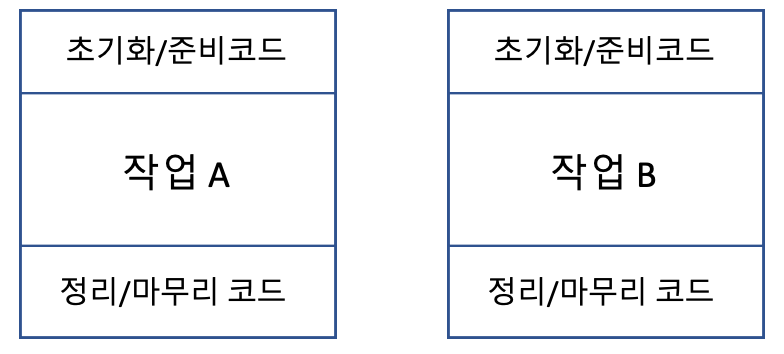
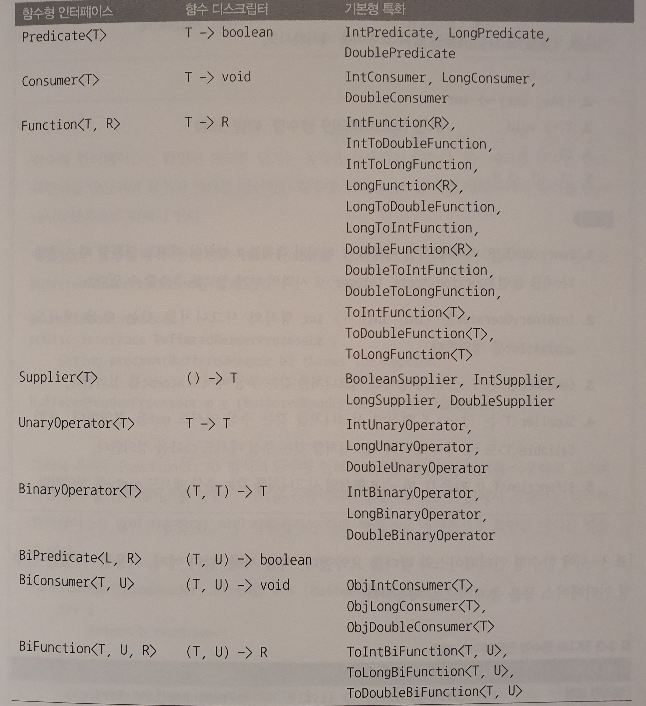

# 람다 표현식
## 3.1 람다란 무엇인가?
**람다표현식**은 메서드로 전달할수 있는 익명함수를 단순화한것이다
 * 익명 : 보통의 메서드와 달리 이름이 없으므로 익명이라 표현한다. 구형해야 할 코드에 대한 걱정거리가 줄어든다
 * 함수 : 람다는 메서드처럼 특정 클래스에 종속되지 않으므로 함수라고 부른다. 하지만 메서드처럼 파라미터 리스트, 바디, 반환 형식, 가능한 예외 리스트를 포함한다.
 * 전달 : 람다 표현식을 메서드 인수로 전달하거나 변수로 저장할 수 있다.
 * 간결성 : 익명 클래스처럼 많은 자질구레한 코드를 구현할 필요가 없다.

 예시)
 ~~~java
 //기존코드
 Comparator<Apple> byWeight = new Comparator<Apple>{
    public int compare(Apple a1, Apple a2){
        return a1.getWeight().comareTo(a2.getWeight());
    }
 }

 //람다코드
 Compare<Apple> byWeight = (Apple a1, Apple a2) -> a1.getWeight().compareTo(a2.getWeight());
 ~~~

 * 파라미터 리스트 : Comparetor의 compare메서드 파타미터(사과두개)
 * 화살표 : 화살표(->)는 람다의 파라미터와 바디를 구분한다
 * 람다 바디 : 두 사과의 무게를 비교한다. 람다의 반환값에 해당하는 표현식
 
 

 ## 3.2 어디에, 어떻게 람다를 사용할까?
 * 함수형 인터페이스
    * 전체표현식을 함수형 인터페이스의 인스턴스로 취급할 수 있다.  (기술적으로 따지면 함수형 인터페이스를 **구현한** 클래스의인스턴스)
 * 함수 디스크립터
   * 람다표현식의 시그니처를 서술하는 메서드
 ### 함수형 인터페이스
 **함수형인터페이스**는 정확히 하나의 추상메서드를 지정하는 인터페이스다  
 chapter2에서 만든 Predicate\<T>가 함수형 인터페이스다. Predicate\<T>는 오직 하나의 추상메서드만 지정하기 때문이다
~~~java
//java.util.Comparator
public interface Comparator<T>{ 
    int compare(T o1, T o2);
}

//java.lang.Runnable
public interface Runnable{ 
    void run();
}

//java.util.comcurrent.Callable
public interface Cllable<V>{ 
    V call() throw Exception;
}

//java.awt.event.ActionListener
public interface ActionListener extends EventListener{
    void actionPerformed(ActionEvent e);
}

//java.security.PrivilegedAction
public interface PrivilegedAction<T>{
    T run();
}
~~~
> 인터페이스는 **디폴트메서드**(인터페이스의 메서드를 구현하지 않은 클래스를 고려해서 기본 구현을 제공하는 바디를 포함하는 메서드)를 포함할 수 있다. 많은 디폴트 메서드가 있더라도 **추상 메서드가 오직 하나면** 함수형 인터페이스이다.

> <a href= "https://github.com/day0ung/ModernJavaInAction/blob/main/java_code/modern_java/src/chapter03/SourceCode032.java"> 예제코드  </a> Runnable이 오직 하나의 추상메서드 run을 정의하는 함수형 인터페이스

 
 

 ## 함수 디스크립터
 예를들어 Runnable 인터페이스의 유일한 추상메서드 run은 인수와 반환값이 없으므로(void 반환) Runnable 인터페이스는 인수화 반환값이 없는 시그니처로 생각할 수 있다.  
 ~~~java
 //1
 public Callable<String> fatch(){
    return () -> "Tricky exaple";
 }

 //2
 Predicate<Apple> p = (Apple a) -> a.getWeight(); 
 ~~~

1번예제는 유효한 람다 포현식이다. fetch메서드의 반환형식은 Callable\<String>이다. T를 String으로 대치했을때 Callable\<String> 메서드의 시그니처는 () -> String이 된다.

2번의 예제에서 람다표현식 (Apple a) -> a.getWeight()의 시그니처는 (Apple) -> Integer 이므로 Predicate\<Apple>: \<Apple> -> boolean의 test메서드의 시그니처와 일치하지 않는다.

 ### **@FunctionallInterface 란?**  
함수형 인터페이스임을 가리키는 어노테이션이다. @FunctionalInterface로 인터페이스를 선언했지만, 실제로 함수형 인터페이스가 아니면 컴파일러가 에러를 발생시킨다. 
 
 

 ## 3.3 람다활용 : 실행 어라운드 패턴
 * 1단계: 동작파라미터화를 기억하라
 * 2단계: 함수형 인터페이스를 이용한 동작전달
 * 3단계: 동작실행
 * 4단계: 동작전달  

**실행어라운드 패턴(execute around pattern)이란?**  
실제 자원을 처리하는 코드를 설정과 정리 두 과정이 둘러싸는 형태를 갖는다.
고정된 설정과 정리 과정을 두고 실제 자원을 처리하는 코드를 설정과 과정리 두 과정이 둘러싸는 형태, 간단히 말하면 db검색을 하려면 connection(열고/닫고)를 꼭 해야한다.  
이때 실제 자원을 처리하는 코드를 파라미터화 하고 람다를 통해 동작을 전달할 수 있다.  
* 

1. 1단계: 동작파라미터화를 기억하라
기존의 설정, 정리 과정은 재사용하고 processFile메서드만 다른 동작을 수행하도록 명령,
BufferedReader를 이용해서 다른 동작을 수행할 수 있도록 메서드로 동작을 전달해야한다. 

2. 2단계: 함수형 인터페이스 이용해서 동작전달
~~~java
@FunctionalInterface
    public interface BufferedReaderProcessor {
        String process(BufferedReader b) throws IOException;
    }
~~~
3. 3단계: 동작실행 (2단계 인터페이스에서 정의된 process메서드의 시그니처와 일치하는 람다를 전달할 수 있다.)

~~~java
public String processFile(BufferedReaderProcessor p ) throws IOException{
    try(BufferedReader br = new BufferedReader(new FileReader('data.txt')) {
        return p.process(br);
    }
}
~~~
4. 4단계
~~~java
 String result = processFile((BufferedReader br) -> br.readLine() + br.readLine());
~~~
> **예제코드** :  <a href="https://github.com/day0ung/ModernJavaInAction/blob/main/java_code/modern_java/src/chapter03/SourceCode033.java">SourceCode033</a>

 
 

 ## 3.4 함수형 인터페이스 사용
 * Predicate
 * Consumer
 * Function
 * 기본형 특화

**Predicate**  <code>(T) → boolean </code>
~~~java
@FuncationalInterface
public interface Predicate<T> {
	boolean test(T t);
}
~~~
Predicate는 test라는 추상메서드를 정의하며, test는 제네릭 형식의 T의 객체를 인수로 받아 불리언을 반환한다  
Predicate 인터페이스의 java_doc명세를 보면 and나 or 같은 메서드도 있다

**Consumer**  <code>(T) → void </code>
~~~java
@FuncationalInterface
public interface Consumer<T> {
	void accept(T t);
}
~~~
Consumer는 제네릭형식 T 객체를 받아서 void 반환하는 accept라는 추상메서드를 정의한다. T형식의 객체를 받아서 어떤 동작을 수행하고 싶을때 사용

**Function**  <code> (T) → R </code>
~~~java
@FuncionalInterface
public interface Function<T, R> {
	R apply(T t);
}
~~~
Function는 제네릭 형식 T를 인수로 받아서 제네릭형식 R 객체를 반환하는 추상메서드 apply를 정의한다

**Supplier**  <code> () → T </code>
~~~java
@FunctionalInterface
public interface Supplier<T> {
	T get();
}
~~~
> **예제코드** :  <a href="https://github.com/day0ung/ModernJavaInAction/blob/main/java_code/modern_java/src/chapter03/SourceCode033.java">SourceCode034</a>

**기본형 특화**  
자바의 모든형식은 참조형(Integer,Object,List) 아니면 기본형(int,double,char)에 해당한다. 제네릭파라미터 (ex: Consumer<T>의 T는 참조형만사용).  
제네릭의 내부구현때문에 어쩔수 없다. 자바에서는 기본형을 참조형으로 변환하는 기능을 제공한다
* 박싱(기본형 -> 참조형)
* 언박싱(참조형 -> 기본형)
* 오토박싱(프로그래머가 편리하게 코드를 구현할수 있도록 박싱/언박싱이 자동)

이러한 변환과정은 비용이 소모된다. 박싱한 값은 기본형을 감싸는 래퍼며 힙에 저장된다. 따라서 박싱한 값은 메모리를 더 소비하여 기본형ㅇㄹ 가져올 때도 메모리를 탐색하는 과정이 필요하다.   
자바 8에서는 기본형을 입출력으로 사용하는 상황에서 오토박싱 동작을 피할 수 있도록 인터페이스를 제공한다
~~~java
ex) IntPredcate 는 1000이라는 값을 박싱하지 않지만, Predicate<Integer>는 1000이라는 값을 객체로 박싱한다

public interface IntPredicate {
    boolean test(T t);
}

IntPredicate eventNumbers = (int i ) -> i % 2 == 0;
eventNumbers.test(1000) <- 참(박싱 없음)

Predicate oddNumbers = (int i ) -> i % 2 != 0;
oddNumbers.test(1000) <- 거짓(박싱)
~~~
* 자바 8에 추가된 함수형 인터페이스
  * 

### 함수형 인터페이스와 예외
java.util.function의 함수형 인터페이스는 확인된 예외를 던지는 동작을 허용하지 않는다. 즉, 예외를 던지는 람다 표현식을 만드려면 확인된 예외를 선언하는 함수형 인터페이스를 직접 정의하거나 람다를 try/catch 블록으로 감싸야 한다.
 
 

 ## 3.5 형식검사, 형식추론, 제약
컴파일러가 람다의 형식을 어떻게 확인하는지, 피해야 할 사항은 무엇인지 알아본다.

**[형식 검사]**  
람다가 사용되는 콘텍스트(context)를 이용해서 람다의 형식(type)을 추론할 수 있다. 어떤 콘텍스트에서 기대되는 람다 표현식의 형식을 **대상 형식(target type)** 이라고 부른다. 형식검사는 다음과 같은 과정으로 진행된다.

1. 람다가 사용된 메서드의 선언을 확인한다.
2. 람다가 사용된 메서드의 파라미터로 대상 형식을 기대한다.
3. 기대하는 파라미터의 함수형 인터페이스를 파악한다.
4. 그 함수형 인터페이스의 함수 디스크립터를 묘사한다.
5. 전달받은 인수의 람다가 그 요구사항을 만족해야 한다.

**[형식추론]**  
자바 컴파일러는 람다 표현식이 사용된 콘텍스트(대상형식)을 이용해서 람다 표현식과 관련된 함수형 인터페이스를 추론한다.   
자바 컴파일러는 다음 처럼 람다 파라미터 형식을 추론할 수 있다.
~~~java
//형식을 추론하지 않음
Comparatro<Apple> c = (Apple a1 , Apple a2) -> a1.getWeight().compareTo(a2.getWeight());

//형식을 추론
Comparatro<Apple> c = (a1 ,a2) -> a1.getWeight().compareTo(a2.getWeight());
~~~

**[지역변수]**  
지금까지 살펴본 모든 람다 표현식은 인수를 자신의 바디안에서만 사용했다. 람다 표현식에서는 익명함수가 하는것처럼 *자유변수*를 활용할수 있다.
* 자유변수: 파라미터로 넘겨진 변수가 아닌 외부에서 정의된 변수  

이와같은 동작을 **람다캡처링** 이라고 부른다.
~~~java
//람다캡쳐링 예제
int portNumber = 1337;
Runnable r = () -> System.out.println(portNumber);

//제약사항
int portNumber = 1337;
Runnable r = () -> System.out.println(portNumber);
portNumber = 133347; // <- 컴파일 오류
~~~
제약사항이 있는데, 람다에서 참고하는 지역벽수는 final로 선언되거나 실직적으로 final처럼 취급되어야한다.

 
 

 ## 3.6 메서드 참조
 * 메서드 참조를 만드는 방법
 * 생성자 참조

 명시적으로 메서드 명을 참조함으로써 가독성을 높일 수 있다. 메서드 참조는 메서드명 앞에 **구분자(::)**를 붙이는 방식으로 사용할 수 있다. Class::method 형식을 취한다. 메서드 참조는 세 가지 유형으로 구분할 수 있다.

1. 정적 메서드 참조 - Integer::parseInt
2. 다양한 형식의 인스턴스 메서드 참조 - String::length
3. 기존 객체의 인스턴스 메서드 참조 - Apple::getWeight
또한 ClassName::new 처럼 클래스명과 new 키워드를 이용해서 기존 생성자의 참조를 만들 수 있다.이는 정적 메서드의 참조를 만드는 방식과 비슷하다.

### 생성자 참조
인수가 없는 생성자, 즉 Supplier의 () -> Apple과 같은 시그니처를 갖는 생성자가 있다고 가정해보자
~~~java
//생성자 참조
Supplier<Apple> c1 = Apple::new;
Apple a1 = c1.get();

Supplier<Apple> c1 = () -> new Apple();
Apple a1 = c1.get();
~~~

* 메서드 참조 단축표현 예제 

| 람다 | 예제 |
|---|---|
| (Apple a) -> a.getWeight() | Apple::getWeight|
|() -> Thread.currentThread().dumpStack() | Thread.currentThread::dumpStack|
| (str, i) -> str.subString(i) | String::substring |

3가지 종류의 람다표현식을 메서드 참조로 바꾸는 방법

~~~java
1. [람다]   
        (args) -> ClassName.staticMethod(args)
   [메서드 참조]
        ClassName::staticMethod

2. [람다]   
        (arg0, rest) -> arg0.instanceMethod(rest)
   [메서드 참조]
        ClassName::instanceMethod //arg0은 ClassName형식

3. [람다]   
        (args) -> expr.instanceMethod(args)
   [메서드 참조]
        expr::instanceMethod
~~~
> **예제코드** 생성자참조:  <a href="https://github.com/day0ung/ModernJavaInAction/blob/main/java_code/modern_java/src/chapter03/SourceCode036.java">SourceCode036</a>

 ## 3.7 람다, 메서드 참조 활용하기
 
> **예제코드**:  <a href="https://github.com/day0ung/ModernJavaInAction/blob/main/java_code/modern_java/src/chapter03/SourceCode03.java">SourceCode037</a>

 ## 3.8 람다 표현식을 조합할수 있는 유용한 메서드 

 함수형 인터페이스에서는 다양한 유틸리티 메서드를 지원한다. Comparator, Function, Predicate 같은 함수형 인터페이스는 람다 표현식을 조합할 수 있도록 유틸리티 메서드를 제공하며, 간단한 여러 개의 람다 표현식을 조합해서 복잡한 람다 표현식을 만들수 있다. 이 유틸리티 메서드는 디폴트 메서드로 제공되어 함수형 인터페이스의 정의를 해치지 않으며 여러 조합을 가능케 하는 유틸리티를 제공한다.

**Comparator**
 - comparing - 비교에 사용할 Function 기반의 키 지정
 - reversed - 역정렬
 - thenComparing - 동일한 조건에 대하여 추가적인 비교

**Predicate**
 - and - and 연산
 - or - or 연산
 - negate - not 연산

**Function**
 - andThen - 이후에 처리할 function 추가
 - compose - 이전에 처리되어야할 function 추가