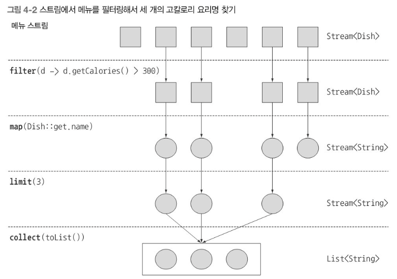

# 스트림 소개

## 스트림이란 무엇인가?
스트림(Stream)은 자바 8 API에 새로 추가된 기능이다. 스트림을 이용하면 선언형으로 컬렉션 데이터를 처리할 수 있다. 멀티스레드 코드를 구현하지 않아도 데이터를 투명하게 병렬로 처리할 수 있다.

스트림을 이용할 때의 장점
* 가비지 변수를 만들지 않는다.
* 선언형으로 코드를 구현할 수 있다.
* 여러 빌딩 블록 연산을 연결해서 복잡한 데이터 처리 파이프라인을 만들 수 있다.
* filter, map, sorted, collect 같은 연산은 고수준 빌딩 블록(high-level building block)으로 이루어져 있으므로 특정 스레딩 * 모델에 제한되지 않고 자유롭게 어떤 상황에서든 사용할 수 있다.
* 스트림 API의 특징은 선언형, 조립할 수 있음, 병렬화로 요약 가능하다.

스트림 API특징
* 선언형 : 더 간결하고 가독성이 좋아진다.
* 조립할 수 있음 : 유연성이 좋아진다.
* 병렬화 : 성능이 좋아진다.  

결과적으로 java8 스트림 API는 데이터 처리과정을 병렬화 하면서 스레드와 락을 걱정할 필요가 없다.

> **스트림 예제코드**:  <a href="https://github.com/day0ung/ModernJavaInAction/blob/main/java_code/modern_java/src/chapter04/SourceCode041.java">SourceCode041</a>

> 스트림연산을 연결해서 스트림 파이프라인 형성      
> menu -> [filter] -> [sorted] -> [map] -> collect 

## 스트림 시작하기 
스트림이란? '데이터 처리 연산을 지원하도록 소스에서 추출된 연속된 요소'
* 연속된 요소: 컬렉션과 마찬가지로 특종 요소 형식으로 이루어진 연속된 값 집합의 인터페이스를 제공한다. 
* 소스: 컬렉션, 배열, I/O 자원등의 데이터 제공 소스로부터 데이터를 소비한다. 정렬된 컬렉션으로 스트림을 생성하면 정렬이 그대로 유지된다.
* 데이터 처리 연산: 함수형 프로그래밍 언어에서 일반적으로 지원하는 연산과 데이터베이스와 비슷한 연산지원.

스트림의 중요 특징
* 파이프라이닝: 스트림 연산끼리 연결해서 커다란 파이프라인을 구성할수 있도록 스트림 자신을 반환한다.(게으름, 쇼트서킷 같은 최적화도 얻을 수있다)
   * 컬렉션은 현재 자료구조가 포함하는 모든 값을 메모리에 저장하는 자료구조다. 즉, 컬렉션의 모든 요소는 컬렉션에 추가하기 전에 계산되어야 한다. 반면 스트림은 이론적으로 요청할 때만 요소를 계산하는 고정된 자료구조다. 이러한 스트림의 특성은 게으른 생성을 가능하게 한다.
* 내부반복: 반복자를 이용해서 명시적으로 반복하는 컬렉션(ex: for-loop)와 달리 스트림은 내부반복을 지원한다.

~~~java
  List<String> lowCaloricDishesNameJava8 =
                menu.stream() //메뉴에서 스트림을 얻는다.
                        .filter(d -> d.getCalories() > 400) // 파이프라인 연산만들기(고칼로리추출 
                        .sorted(comparing(Dish::getCalories)) //칼로리로 요리정렬
                        .map(Dish::getName) //요리명 추출
                        .limit(3) // 선착순 3개만 선택
                        .collect(toList()); //결과를 다른 리스트로 저장
        System.out.println(lowCaloricDishesNameJava8);
~~~

collect()를 제외한 모든 연산은 서로 **파이프라인**을 형성할수 있도록 스트림을 반환한다.   
마지막에 collect를 호출하기 전까지는 menu에서 무엇도 선택되지않으며 출력결과도 없다. 
* filter: 람다를 인수로 받아 스트림에서 특정 요소를 제외시킨다.
* map: 람다를 이용해서 한 요소를 다른 요소로 반환하거나 정보를 추출한다.
* limit: 정해진 개수 이상의 요소가 스트림에 저장되지 못하게 스트림크기 제한
* collect:  스트림을 다른 형식으로 반환한다. 예제의 toList()는 리스트르 반환했다. 6장에서 더자세히 다룸

## 스트림과 컬렉션
데이터를 **언제** 계산하느냐가 켈력션과 스트림의 가장 큰 차이이다.

* 컬렉션 : 현재 자료구조가 포함하는 **모든** 값을 메모리에 저장하는 자료구조이다. 즉, 컬렉션의 모든 요소는 컬렉션에 추가하기 전에 계산되어야한.
(컬렉션에 요소를 추가/삭제할수있다.)
  * 적극적으로 생성됨(생산자중심 : 팔기도전에 창고를 가득채움)
* 스트림 : **요청할 때만 요소를 계산**하는 고정된 자료구조이다.
(스트림에 요소를 추가/삭제할수 **없다**)  
 사용자가 요청하는 값만 스트림에서 추출한다는것이 핵심이다.
  * 
스트림은 자세히 표현하자면 데이터 처리 연산을 지원하도록 소스에서 추출된 연속된 요소로 정의할 수 있다.

스트림은 반복자와 마찬가지로 한 번만 탐색할 수 있다. 탐색된 스트림의 요소는 소비된다.
