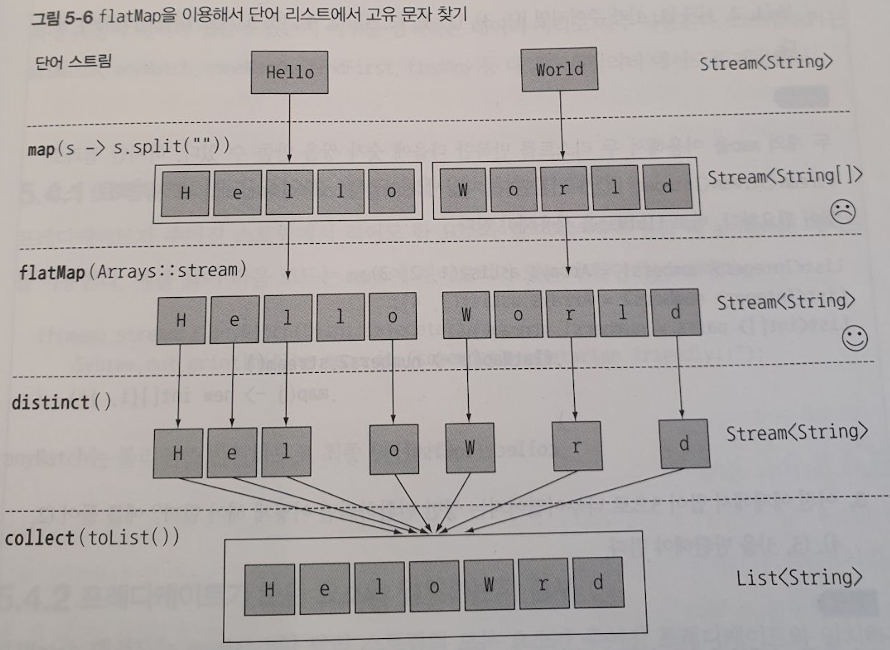

# 스트림 활용
 스트림 API가 지원하는 다양한 연산들
 * [필터링](#51-필터링)
 * [스트림 슬라이싱](#52-스트림-슬라이싱)
 * [매핑](#53-매핑)
 * [검색과 매칭](#54-검색과-매칭)
 * [리듀싱](#55-리듀싱)
 * [숫자형 스트림](#56-숫자형-스트림)
 * [스트림 만들기](#57-스트림-만들기)

 
 

## 5.1 필터링
* ***filter - Predicate를 통한 필터링***
~~~java
Stream<T> filter(Predicate<? super T> predicate);
~~~
* ***distinct - 고유 요소만 필터링***
~~~java
Stream<T> distinct();
~~~
 
 

## 5.2 스트림 슬라이싱
### 프레디케이트를 이용한 슬라이싱
> **예제코드**:  <a href="https://github.com/day0ung/ModernJavaInAction/blob/main/java_code/modern_java/src/chapter05/SourceCode052.java">SourceCode052</a>

 * ***takeWhile***: Predicate의 결과가 true인 요소에 대한 필터링. Predicate이 처음으로 거짓이 되는 지점에 연산을 멈춘다.
   * <code> Stream<T> takeWhile(Predicate<? super T> predicate) </code>
 * ***dropWhile***: Predicate의 결과가 false인 요소에 대한 필터링. Predicate이 처음으로 거짓이 되는 지점까지 발견된 요소를 버린고 남은 요소반환 (takeWhile과 정반대의 작업)
    * <code> Stream<T> dropWhile(Predicate<? super T> predicate)</code>

 ~~~java

Stream.of(1,2,3,4,5,6,7,8,9)
                .filter(n -> n%2 == 0)
                .forEach(System.out::println);
/*filter 결과: 2,4,6,8, */

Stream.of(2,4,3,4,5,6,7,8,9)
        .takeWhile(n -> n%2 == 0)
        .forEach(System.out::println);
/*takeWhile 결과: 2,4 */

Stream.of(2,4,3,4,5,6,7,8,9)
        .dropWhile(n -> n%2 == 0)
        .forEach(System.out::println);
/*dropWhile 결과: 3,4,5,6,7,8,9 */
 ~~~

### 스트림 축소
***limit*** - 주어진 값 이하의 크기를 갖는 새로운 스트림을 반환한다.  
~~~java
Stream<T> limit(long maxSize)
~~~
<code>limit(3) -> 프레디케이트와 일치하는 처음 3번째 요소 반환 </code>

### 요소 건너뛰기
***skip*** - 처음 n개 요소를 제외한 스트림을 반환한다. 
~~~java
Stream<T> skip(long n);
~~~

 
 

## 5.3 매핑
특정 객체에서 특정 데이터를 선택하는 작업. 인수로 제공된 함수는 각 요소에 적용되며 함수를 적용한 결과가 새로운 요소로 매핑된다.  
(이과정은 기존의 값을 '고친다'라는 개념보다 '새로운 버전을 만든다'라는 개념에 가까워, 변환에 가까운 **매핑**이라는 단어를 사용한다.)

### 스트림의 각요소에 함수 적용하기
* map - 함수를 인수로 받아 새로운 요소로 매핑된 스트림을 반환한다. 기본형 요소에 대한 mapToType 메서드도 지원한다 (mapToInt, mapToLong, mapToDouble).
~~~java
<R> Stream<R> map(Function<? super T, ? extends R> mapper);
~~~
### 스트림 평면화
* ***flatMap*** : 각 배열을 스트림이 아니라 스트림의 콘텐츠로 매핑한다. 스트림의 각 값을 다른 스트림으로 만든다음에 모든 스트림을 하나의 스트림으로 연결하는 기능을 수행한다. 
> <a href= "https://github.com/day0ung/ModernJavaInAction/blob/main/java_code/modern_java/src/chapter05/SourceCode053.java"> 예제코드 </a> : SourceCode053

> 

 
 

## 5.4 검색과 매칭
* ***anyMatch*** - 적어도 한 요소와 일치하는지 확인하는 최종 연산이다 (일치하는 순간 true 반환).
~~~java
boolean anyMatch(Predicate<? super T> predicate);
~~~
* ***allMatch*** - 모든 요소와 일치하는지 검사하는 최종 연산이다 (일치하지 않는 순간 false 반환).
~~~java
boolean allMatch(Predicate<? super T> predicate);
~~~
* ***noneMatch*** - 모든 요소가 일치하지 않는지 검사하는 최종 연산이다 (일치하는 순간 false 반환).
~~~java
boolean noneMatch(Predicate<? super T> predicate);
~~~

> anyMatch, allMatch, noneMatch 세 메서드는 스트림 ***쇼트서킷*** 기법, 즉 자바의 &&, ||와 같은 연산을 활용한다.

>> 쇼트서킷 평가  
  전체 스트림을 처리하지 않았더라도 결과를 반환할수 있다. 예를들어 and 연산으로 연결된 커다란 boolean 표현식을 평가한다고 할때, 표현식에서 하나라도 거짓이라는 결과가 나오면 나머지 표현식의 결과와 상관없이 전체 결과도 거짓이 된다. 

* ***findFirst*** - 첫 번째 요소를 찾아 반환한다. 순서가 정해져 있을 때 사용한다.
~~~java
Optional<T> findFirst();
~~~

* ***findAny*** - 요소를 찾으면 반환한다. 요소의 반환순서가 상관없을 때 findFirst 대신 사용된다.
~~~java
Optional<T> findAny();
~~~

> **Optional** 이란?  
값의 존재나 부재 여부를 표현하는 컨테이너 클래스이다. 값이 존재하는지 확인하고 값이 없을때 어떻게 처리할지 강제하는 기능을 제공한다. 
> * isPresent() : 값을 포함하면 true반환, 포함하지않으면 false반환
> * ifPresent(Consumer<T> block) : 값이 있으면 주어진 블록실행, T인수를 받으며 void반환
> * T get() : 값이 존재하면 값을 반환, 값이없으면 NoSuchElementException 발생
> * T orElse(T other) : 값이 있으면 값을 반환, 값이없으면 기본값 반환

 
 

## 5.5 리듀싱

 
 

## 5.6 숫자형 스트림

 
 

## 5.7 스트림 만들기
