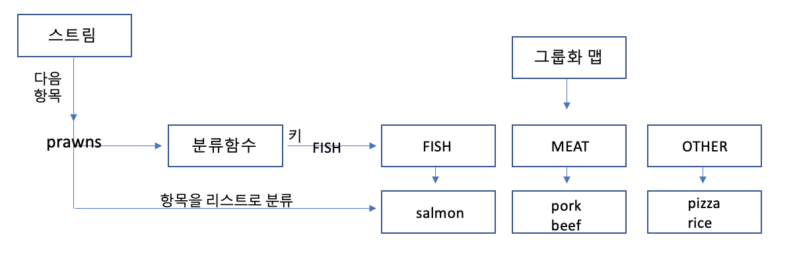

# 스트림으로 데이터 수집
 * [Collector](#61-collector)
 * [리듀싱과 요약](#62-리듀싱과-요약)
 * [그룹화](#63-그룹화)
 * [분할](#64-분할)
 * [Collector 인터페이스](#65-collector-인터페이스)
 * [커스텀 컬렉터를 구현해서 성능 개선하기](#66-커스텀-컬렉터를-구현해서-성능-개선하기)

## 6.1 Collector

Collector 인터페이스 구현은 스트림 요소를 어떤 식으로 도출할지 지정한다. 훌륭하게 설계된 함수형 API의 장점으로는 높은 수준의 조합성과 재사용성을 꼽을 수 있다. Collector 인터페이스 메서드를 어떻게 구현하느냐에 따라 스트림에 어떤 리듀싱 연산을 수행할지 결정된다. Collectors 유틸리티 클래스는 자주 사용하는 컬렉터 인스턴스를 손쉽게 생성할 수 있는 정적 팩토리 메서드를 제공한다.

Collectors에서 제공하는 메서드의 기능은 크게 세 가지로 구분할 수 있다.

* 스트림 요소를 하나의 값으로 리듀스하고 요약
* 요소 그룹화
* 요소 분할

## 6.2 리듀싱과 요약
컬렉터 (Stream.collect 메서드의 인수)로 스트림의 항목을 컬렉션으로 재구성 할수 있다. 즉, 스트림의 모든 항목을 하나의 결과로 합칠 수 있다.   
* 예제: counting() 팩터리 메서드가 반환하는 컬렉터로 수 계산
    * ~~~java
       long hoManyDishes = menu.stream().collect(Collectors.coungting());

       //Collectors 과정생략
       long hoManyDishes =  menu.stream().count();
       ~~~

**스트림 값에서 최댓값과 최솟값 검색**  
Collectors.maxBy , Collectors.minBy 
* 예제: Comparator로 칼로리를 비교 후 Collector.maxBy로 전달하는 코드 
    * ~~~java
       Comparator<Dish> compare = Comparator.comparingInt(Dish::getCalories);

       Optional<Dish> max = menu.stream().collect(maxBy(compare))
       ~~~
  
**요약연산**  
Collectors.summingInt  
객체를 int로 매핑하는 함수를 인수로 받는다. 
~~~java
int total = menu.stream().collect(summingInt(Dish::getCalories));
~~~
이러한 연산외에 평균간 계산등의 연산도 요약기능이 제공된다.  
* averagingInt, averagingLong, averagingDouble

**문자열 연결**  
joining  
스트림의 각 객체에 toString메서드를 호출해서 추출한 모든 문자열을 하나의 문자열로 연결해서 반환한다.  
~~~java
String menu = menu.stream().map(Dish::getName).collect(joining());
~~~
**범용 리듀싱 요약연산**  
지금까지 살펴본 모든 컬렉터는 reducing 팩터리 메서드로도 정의할수 있다.(즉, Collecttors.reduing)

~~~java
//모든 칼로리 합계를 계산 (인수 3개)
int total = menu.stream().collect(reduing(0,Dish::getCalories, (i,j -> i+j )))
~~~
* reducing은 인수 세개를 받는다. 
    * 첫번째 인수: 리듀싱연산의 시작값 혹은 인수가 없을때 반환값
    * 두번째 인수: 요리를 칼로리 정수로 변환, 변환함수
    * 세번째 인수: 같은종류의 두항목을 하나의 값으로 더함

~~~java
//모든 칼로리 합계를 계산(인수 1개)
Optional<Dish> total = menu.stream().collect(reduing(
    (d1,d2) -> d1.getCalories() > d2.getCalories() ? d1 :d2
    ));
~~~

>💡collect와 reduce  
collect와 reduce를 이용하면 동일한 기능을 구현할 수 있다. 하지만 의미론적인 문제와 실용성 문제등에 대하여 차이가 존재한다.  
collect 메서드는 도출하려는 결과를 누적하는 컨테이너를 바꾸도록 설계된 메서드인 반면, reduce는 두 값을 하나로 도출하는 불변형 연산이라는 점에서 의미론적인 차이가 존재한다.  
여러 스레드가 동시에 같은 데이터 구조체를 고치면 리스트 자체가 망가져버리므로 리듀싱 연산을 병렬로 수행할 수 없다. 이럴 때 가변 컨테이너 관련 작업이면서 병렬성을 확보하려면 collect 메서드로 리듀싱 연산을 구현하는것이 바람직하다.

**✍ 리듀싱과 요약 (컬렉터 인스턴스 활용)** 
* counting - 개수를 카운트한다
* maxBy, minBy - 최대 혹은 최소를 만족하는 요소를 찾는다
* summingInt - 객체를 int로 매핑하는 인수를 받아 합을 계산한다
* averagingInt - 객체를 int로 매핑하는 인스를 받아 평균을 계산한다
* summarizingInt - 요소 수, 합계, 평균, 최댓값, 최솟값 등을 계산한다.
* joining - 내부적으로 StringBuilder를 이용해서 문자열을 하나로 만든다.

## 6.3 그룹화
데이터 집합을 하나 이상의 특성으로 분류해서 그룹화 하는 연산도 데이터 베이스에서 많이 수행되는 작업이다.  
**Collectors.groupingBy**를 이용해서 데이터를 그룹화할 수있다. 이 함수를 기준으로 그룹화 되므로 이를 **분류함수**라고 부른다
*  groupingBy
 ~~~java
  Collector<T, ?, Map<K, D>> groupingBy(Function<? super T, ? extends K> classifier,
                                          Collector<? super T, A, D> downstream) {
        return groupingBy(classifier, HashMap::new, downstream);
    }
  ~~~
* 예시
  ~~~java
    Map<Dish.Type, List<Dish>> dishesByType = 
                          menu.stream().collect(groupingBy(Dish::getType))
  
  //결과 : {FISH=[prawns, salmon], OTHER=[french fries, rice, pizza], MEAT=[pork,beef]}
  ~~~

***그룹화로 스트림의 항목을 분류하는 과정**

### 그룹화된 요소 조작
요소를 그룹화 한 다음에는 각 결과 그룹의 요소를 조작하는 연산이 필요하다.  
> **그룹화 예제코드**:  <a href="https://github.com/day0ung/ModernJavaInAction/blob/main/java_code/modern_java/src/chapter06/SourceCode063.java">SourceCode063</a>
* filtering(): 프레디케이트를 인수로 받아 각 그룹의 요소와 필터링된 요소를 재그룹화
  * ~~~java
     Collector<T, ?, R> filtering(Predicate<? super T> predicate,
                                 Collector<? super T, A, R> downstream)
    ~~~
* mapping(): 매핑함수와 각 항목에 적용한 함수를 모으는데 사용하는 또 다른 컬렉터를 인수로 받아 요소를 변환
  * ~~~java
    Collector<T, ?, R> mapping(Function<? super T, ? extends U> mapper,
                               Collector<? super U, A, R> downstream)
    ~~~
### 다수준 그룹화 
두 인수를 받는 팩토리 메서드 Collectors.groupingBy를 이용하여 항목을 다수준으로 그룹화 할 수 있다.  
groupingBy는 일반적으로 분류함수와 컬렉터를 인수로 받는다. 즉, 바깥쪽 groupingBy 메서드에 스트림의 항목을 분류할 두번째 기준을 정의하는   
내부 groupingBy를 전달해서 두 수준으로 스트림의 항목을 그룹화 할수 있다.
~~~java
Map<Dish.TYPE, Map<CaloricLevel, List<Dish>>> dishesByCaloricLevel = 
    menu.stream().collect(
            groupingBy(Dish::getType, //첫번째 수준의 분류함수
                groupingBy(dish -> { //두번째 수준의 분류함수
                    if(dish.getCalories() <= 400)
                        return CaloricLevel.DIET;
                    else if(dish.getCalories () <= 700)
                        return CaloricLevel.NORMAL; 
                    else return CaloricLevel.FAT;
                })  
            
            ) 
        )
~~~

### 서브그룹으로 데이터 수집
groupingBy로 넘겨주는 컬렉터의 형식은 제한이 없다. groupingBy(f)는 groupingBy(f, toList())의 축약형이다.
* <code> groupingBy(Dish::getType, counting())</code>
* <code> groupingBy(Dish::getType, maxBy(comparingInt(Dish::getCalories)))</code>

***컬렉터중첩** (예제, 각 서브그룹에서 가장 칼로리가 높은 요리찾기)
~~~java
Map<Dish.Type, Dish> mostCaloricByType = 
    menu.stream()
        .collect(groupingBy(Dish::Type, // 분류 함수
                collectingAndThen(
                    maxBy(comparingInt(Dish::getCalories)), // 감싸인 컬렉터
                Optional::get)); // 변환 함수
~~~
컬렉터를 중첩할 시 가장 외부 계층에서 안쪽으로 다음과 같은 작업이 수행된다.

1. 가장 바깥쪽에 위치한 groupingBy에서 분류하는 요소(Dish.Type)에 따라 서브스트림으로 그룹화 한다
2. groupingBy 컬렉터는 collectingAndThen으로 컬렉터를 감싼다. 따라서 두 번째 컬렉터는 그룹화된 서브스트림에 적용된다.
3. collectingAndThen 컬렉터는 세번째 컬렉터인 maxBy를 감싼다.
4. 리듀싱 컬렉터(maxBy)가 서브스트림에 연산을 수행한 결과에 Opional::get 변환 함수가 적용된다.
5. groupingBy 컬렉터가 반환하는 맵의 분류 키에 대응하는 값이 각각의 Dish에서 가장 높은 칼로리이다.

>💡 groupingBy, 그룹핑에 핵심적인 메서드이며 많은 오버로딩된 메서드를 가진다
~~~java
// 분할 함수
public static <T, K> Collector<T, ?, Map<K, List<T>>> groupingBy(
        Function<? super T, ? extends K> classifier) {

        return groupingBy(classifier, toList());
        }

// 분할 함수, 감싸인 컬렉터
public static <T, K, A, D> Collector<T, ?, Map<K, D>> groupingBy(
        Function<? super T, ? extends K> classifier,
        Collector<? super T, A, D> downstream) {

        return groupingBy(classifier, HashMap::new, downstream);
        }

// 분할 함수, 반환 타입, 감싸인 컬렉터
public static <T, K, D, A, M extends Map<K, D>> Collector<T, ?, M> groupingBy(
        Function<? super T, ? extends K> classifier,
        Supplier<M> mapFactory,
        Collector<? super T, A, D> downstream) {
        // ...
        }
~~~
## 6.4 분할

분할은 분할 함수(partitioning function)라 불리는 Predicate를 분류 함수로 사용하는 특수한 그룹화 기능이다. 맵의 키 형식은 Boolean이며, 결과적으로 그룹화 맵은 참 아니면 거짓을 갖는 두 개의 그룹으로 분류된다.  
분할의 장점은 참, 거짓 두 가지 요소의 스트림 리스트를 모두 유지한다는 것이 장점이다.  

## 6.5 Collector 인터페이스
## 6.6 커스텀 컬렉터를 구현해서 성능 개선하기