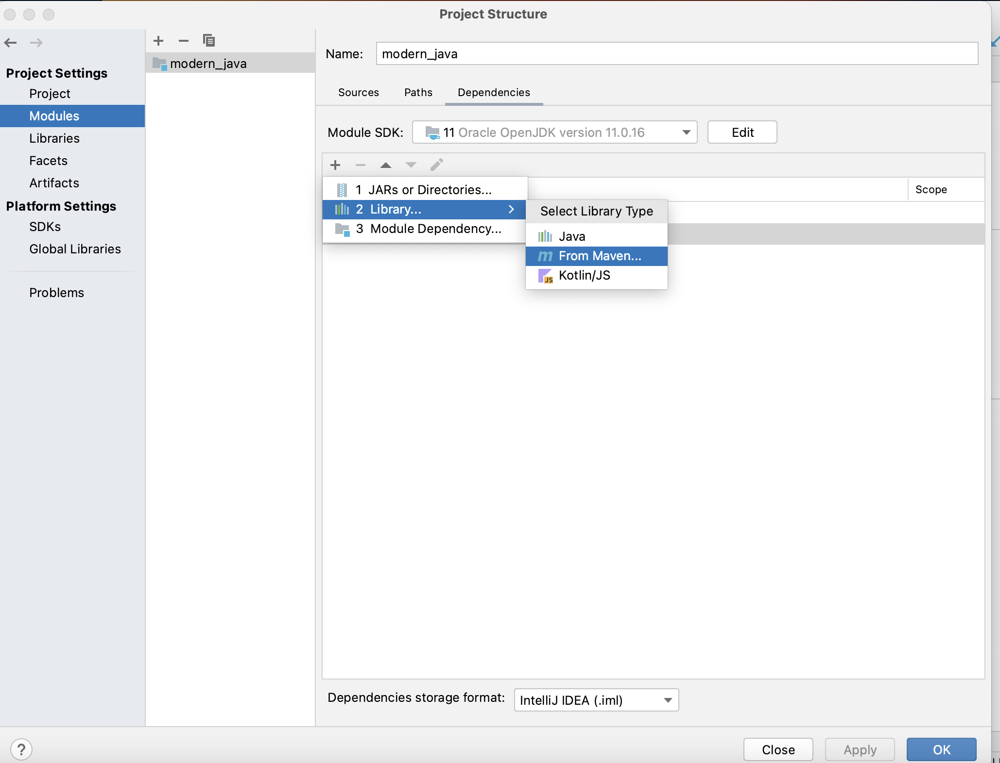
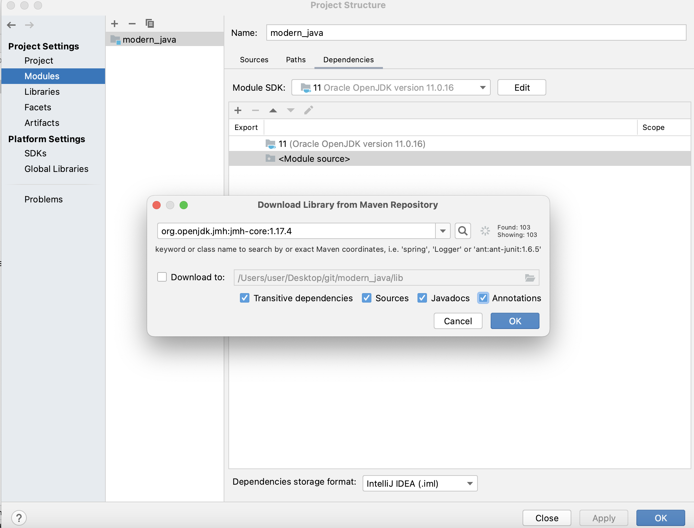
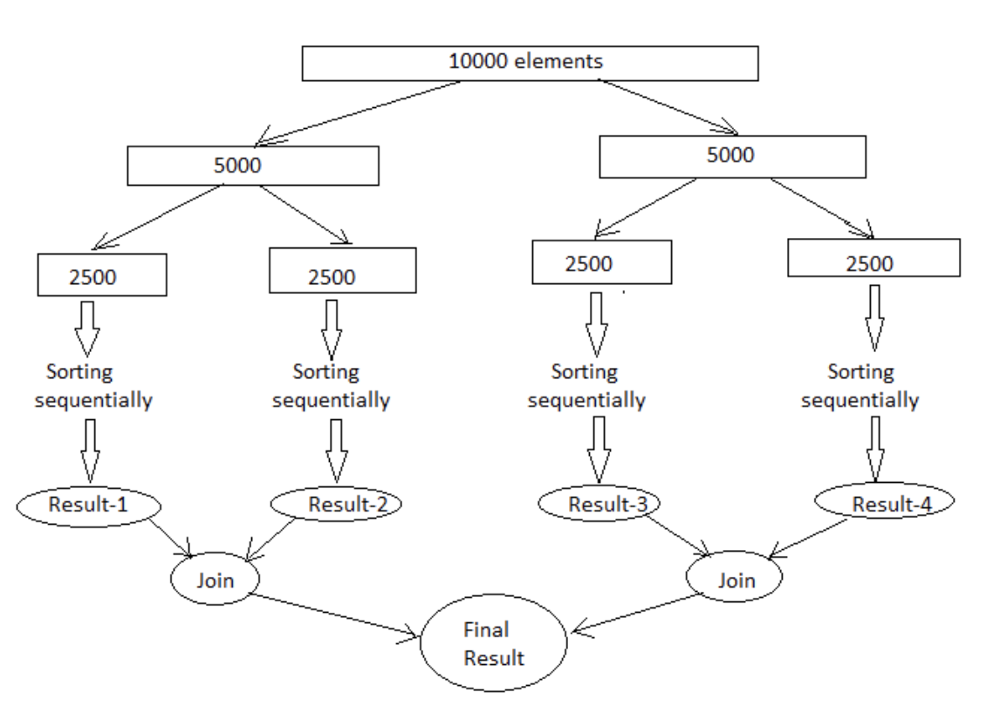
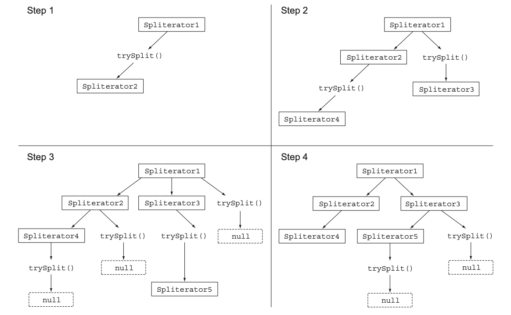

# 병렬데이터 처리와 성능
자바 7이 등장하기 전에는 자바에서 병렬처리를 할려면 많은 노력을 해야했다.
1. 데이터를 서브파트로 분할
2. 분할된 서브파트를 각각의 스레드로 할당
3. 할당 후 의도치 않은 레이스 컨디션(경쟁 상태) 가 발생하지 않도록적절한 동기화 추가
4. 마지막으로 부분 결과를 합침
 
자바 7은 쉽게 병렬화를 수행하면서 에러를 최소화할 수 있도록 포크/조인 프레임워크(fork/join framework) 기능을 제공한다.
자바 8이후부터 나온 stream 파이프라인으로 병렬처리를 하는 방법과 내부적으로 일어나는 과정, 그 과정에서 발생하는 병렬 스트림의 성능에 대해 알아본다.

* [병렬 스트림](#71-병렬-스트림)
* [포크/조인 프레임워크](#72-포크조인-프레임워크)
* [Spliterator 인터페이스](#73-spliterator-인터페이스)

## 7.1 병렬 스트림
📌 병렬 스트림이란, 각각의 **스레드**에서 처리할 수 있도록 스트림 요소를 여러 청크로 분할한 스트림이다.  
따라서 병렬 스트림을 이용하면 모든 멀티코어 프로세서가 각각의 청크를 처리하도록 할당할 수 있다.

컬렉션에서 parallelStream 을 호출하면 병렬 스트림이 생성된다. 병렬 스트림이란 각각의 스레드에서 처리할 수 있도록 스트림 요소를 여러 chunk로 분할한 스트림이다.  

* 숫자 n을 인수로 받아서 1부터 n까지의 모든 숫자의 합계를 반환하는 메서드를 구현해보자.
  * ~~~java
      //스트림 사용
      public long sequentialSum() {
        return Stream.iterate(1L, i -> i + 1)
        .limit(N)
        .reduce(0L, Long::sum);
      }
  
      // 전통적인 for-loop
      public long iterativeSum() {
        long result = 0;
        for(long i = 1L; i<N; i++) {
          result += i;
        }
        return result;
      }
    ~~~
* 위의 연산은 N이 커진다면 부하가 커질 것이므로 병렬로 처리하는 것이 좋다. 이제 병렬 스트림을 사용해보자
  * ~~~java
    public long parallelSum() {
       return Stream.iterate(1L, i -> i + 1).limit(N)
       .parallel() // 스트림을 병렬 스트림으로 변환
       .reduce(0L, Long::sum);
    }
    ~~~
  * **parallel()** 메서드를 쓰면 스트림이 여러 chunk 로 분할된다. 이렇게 분할된 chunk를 병렬로 수행한 뒤에, 리듀싱 연산으로 합쳐서 전체 스트림의 리듀싱 결과를 도출한다.

> 이렇게 만들어진 스레드는 어디서 생성되며 몇 개나 생성될까? 병렬 스트림은 내부적으로 ForkJoinPool 을 사용한다.  
ForkJoinPool은 프로세서 수, 즉 Runtime.getRuntime().availableProcessors() 가 반환하는 값에 상응하는 스레드를 갖는다
> ~~~java
> // 전역설정코드!! 시스템의 병렬 스레드 수를 지정할 수 있다.
> System.setProperty("java.util.concurrent.ForJoinPool.common.parallelism", "12");
> ~~~

### 스트림 성능 측정
병렬화를 이용하면 순차나 반복 형식에 비해 성능이 더 좋아질 것이라 추측했다. 하지만 가장 좋은 방법은 직접 측정하는 것이다. 자바 마이크로벤치마크 하니스(Java Microbenchmark Harness) JHM 라이브러리를 이용해 벤치마크를 구현해본다. 

JMH를 이용하면 간단하고, 어노테이션 기반 방식을 지원하며, 안정적으로 자바 프로그램이나 자바 가상 머신(JVM)을 대상으로 하는 다른 언어용 벤치마크를 구현할 수 있다.

***Maven 설정***
~~~java
<dependency>
	<groupId>org.openjdk.jmh</groupId>
	<artifactId>jmh-core</artifactId>
	<version>1.17.4</version>
</dependency>
<dependency>
	<groupId>org.openjdk.jmh</groupId>
	<artifactId>jmh-generator-annprocess</artifactId>
	<version>1.17.4</version>
</dependency>

<build>
	<plugins>
		<plugin>
			<groupId>org.apache.maven.plugins</groupId>
			<artifactId>maven-shade-plugin</artifactId>
			<executions>
				<execution>
					<phase>package</phase>
					<goals><goal>shade</goal></goals>
					<configuration>
						<finalName>benchmarks</finalName>
						<transformers>
							<transformer implementation=
									"org.apache.maven.plugins.shade.resource.ManifestResourceTransformer">
								<mainClass>org.openjdk.jmh.Main</mainClass>
							</transformer>
						</transformers>
					</configuration>
				</execution>
			</executions>
		</plugin>
	</plugins>
</build>
~~~

| intelli J 설정                |                       |
|-----------------------------|-----------------------| 
| cmd + ; (project Structure) |  |
|Modules -> + 버튼 누른후 검색 |  | 

***n개의 숫자를 더하는 함수의 성능 측정***

~~~java
@BenchmarkMode(Mode.AverageTime)
@OutputTimeUnit(TimeUnit.MILLISECONDS)
@Fork(value = 2, jvmArgs = {"-Xms4G", "-Xmx4G"})
@State(Scope.Benchmark)
public class MyBenchmark {
    private static final long N = 10_000_000L;

    @Benchmark  // 벤치마크 대상 메서드
    public long benchmark() {
			// n개의 숫자를 더하는 로직 구현
    }

    @TearDown(Level.Invocation) // 매 번 벤치마크를 실행한 다음에는 가비지 컬렉터 동작 시도
    public void tearDown() {
        System.gc();
    }
}
~~~

~~~shell 
실행
$ mvn clean install
$ java -jar target/benchmark.jar
~~~

> **스트림성능 측정 예제코드**:  <a href="https://github.com/day0ung/ModernJavaInAction/blob/main/java_code/modern_java/src/chapter07/SourceCode071.java">SourceCode071</a>

**결과**
1. LongStream.parallel - 2.782
2. for-loop(sequential) - 2.870
3. LongStream.sequential - 3.258
4. Stream.iterate.parallel - 76.854
5. Stream.iterate.sequential - 78.975
 
하드웨어 스펙에 따라 차이가 더 날 수 있지만 오토박싱의 오버헤드를 없애고 rangeClosed 메서드를 이용해 쉽게 청크로 분할할 수 있도록 하여 parallel을 적용하니 성능을 개선할 수 있었다.

### 병렬 스트림 효과적으로 사용하기
* 확신이 서지 않으면 직접 측정하라. 순차 스트림에서 병렬 스트림으로 쉽게 바꿀 수 있다. 반드시 적절한 벤치마크로 직접 성능을 측정하자
* 박싱을 주의하라. 되도록이면 기본형 특화 스트림을 사용하자.
* 순차 스트림보다 병렬 스트림에서 성능이 떨어지는 연산들을 피하라. limit나 findFirst처럼 요소의 순서에 의존하는 연산을 병렬 스트림에서 수행하려면 비싼 비용을 치러야 한다.
* 스트림에서 수행하는 전체 파이프라인 비용을 고려하라. 처리해야할 요소 수가 N, 하나의 요소를 처리하는 데 드는 비용이 Q라하면 전체 스트림 파이프라인 처리비용은 N*Q로 예상할 수 있다. Q가 높아진다는 것은 병렬 스트림으로 성능을 개선할 수 있는 가능성이 있음을 의미한다.
* 소량의 데이터에서는 병렬 스트림이 도움되지 않는다. 병렬화 과정에서 생기는 부가 비용을 상쇄할 수 있을 만큼의 이득을 얻지 못하기 때문이다.
* 스트림을 구성하는 자료구조가 적절한지 확인하라. 예로, ArrayList는 LinkedList보다 효율적으로 분할할 수 있다. 또한 range 팩토리 메서드로 만든 기본형 스트림도 쉽게 분해할 수 있다. 또한 Spliterator를 구현해서 분해 과정을 완벽하게 제어할 수 있다.
최종 연산의 병합 비용을 살펴보라.

 

## 7.2 포크/조인 프레임워크
포크/조인 프레임워크는 병렬화할 수 있는 작업을 재귀적으로 작은 작업으로 분할한 다음 서브태스크 각각의 결과를 합쳐서 전체 결과를 만들도록 설계되었다.

### RecursiveTask 활용
쓰레드 풀 이용을 위해선 RecursiveTask의 서브클래스 혹은 RecursiveAction의 서브클래스를 만들어야 한다. RecursiveTask의 R은 병렬화된 태스크가 생성하는 결과 형식을 의미하면 RecursiveAction은 결과 형식이 없을 경우에 사용한다.
RecursiveTask를 이용하기 위해선 compute 메서드를 구현해야 한다. compute 메서드는 태스크를 서브태스크로 분할하는 로직과 더 이상 분할할 수 없을 때 개별 서브태스크의 결과를 생산할 알고리즘을 정의한다.  
* RecursiveTask를 정의하려면 추상메서드 compute를 구현해야한다. 
* <code> protected abstract R compute() </code>

~~~java
if (태스크가 충분히 작거나 더 이상 분할할 수 없으면) {
	순차적으로 태스크 계산
} else {
	태스크를 두 서브 태스크로 분할
	태스크가 다시 서브태스크로 분할되도록 이 메서드를 재귀적으로 호출함
	모든 서브태스크의 연산이 완료될 때까지 기다림
	각 서브태스크의 결과를 합침
}

// 이 알고리즘은 분할정복 알고리즘의 병렬화 버전이다.
~~~

📌 **포크/조인 과정**

  * Fork/Join 프레임워크는 병렬화할 수 있는 작업을 재귀적으로 작은 작업으로 분할하고, 서브 태스크 각각의 결과를 합쳐서 전체 결과를 만들도록 설계됐다.
  * Fork/Join 프레임워크에서는 서브 태스크를 스레드 풀(ForkJoinPool)의 작업자 스레드에 분산 할당하는 ExecutorService 인터페이스를 구현한다.
    포크 조인 프레임워크는 작업 훔치기 라는 기법을 통해 모든 스레드를 거의 공정하게 분할하고 각각의 스레드가 유휴 상태에 빠지지 않게 다른 스레드의 큐에 있는 작업을 훔쳐와서 작업을 수행한다. 모든 태스크가 작업을 끝날 때 까지 이 과정을 반복한다.

포크 조인 프레임워크를 사용하기 위해서는 이미 구현되어 있는 추상클래스 RecursiveAction나 RecursiveTask를 사용하면 된다.  
RecursiveAction : 작업의 결과를 반환하지 않는다.  
RecursiveTask : 작업의 결과를 반환한다.

***ForkJoin 프레임워크를 이용해 배열의 합을 구해보자.***
> **포크/조인 프레임워크를 용해서 병렬합계 수행 예제코드**:  <a href="https://github.com/day0ung/ModernJavaInAction/blob/main/java_code/modern_java/src/chapter07/SourceCode072.java">SourceCode072</a> 

### 포크/조인 프레임워크를 제대로 사용하는 방법
* join 메서드를 태스크에 호출하면 태스크의 결과가 리턴될 때 까지 블록된다. 따라서 join은 두 서브태스크가 모두 시작된 다음에 호출해야 한다. 그렇지 않으면 서브태스크가 다른 태스크가 끝날때까지 기다리는 일이 발생하면서 더 느려질 수 있다.
* RecursiveTask 내에서는 invoke 메서드를 사용하면 안된다. 대신 compute나 fork 메서드를 직접 호출할 수 있다. 순차 코드에서 병렬 계산을 시작할 때만 invoke를 사용한다.
* 왼쪽 태스크와 오른쪽 태스크 모두에 fork를 호출하는게 자연스럽지만, 같은 스레드를 재사용하기 위해 한쪽에는 fork, 다른 한쪽에는 compute를 호출하는 것이 스레드 사용 효율면에서 효율적이다.
디버깅하기 어렵다. fork 라 불리는 다른 스레드에서 compute를 호출하기 때문에 스택 트레이스가 도움이 되지 않기 때문이다.

### 작업 훔치기
포크/조인 프레임워크에서는 작업 훔치기(work stealing)라는 기법을 사용한다.   
각각의 스레드는 자신에게 할당된 태스크를 포함하는 이중 연결 리스트(doubley linked list)를 참조하면서 작업이 끝날 때마다 큐의 헤드에서 다른 태스크를 가져와서 작업을 처리한다. 이때 한 스레드는 다른 스레드보다 자신에게 할당된 태스크를 더 빨리 처리할 수 있는데, 할일이 없어진 스레드는 유휴 상태로 바뀌는 것이 아니라 다른 스레드의 큐의 꼬리에서 작업을 훔쳐온다. 모든 태스크가 작업을 끝낼 때 까지 이 과정을 반복한다.  
따라서 태스크의 크기를 작게 나누어야 작업자 스레드 간의 작업부하를 비슷한 수준으로 유지할 수 있다.

## 7.3 Spliterator 인터페이스
Spliterator 는 **분할할 수 있는 반복자**라는 의미이다. Iterator 처럼 소스의 요소 탐색 기능을 제공한다는 점은 같지만 Spliterator는 병렬 작업에 특화되어 있다.
~~~java
public interface Spliterator<T> {
	boolean tryAdvance(Consumer<? super T> action);
	Spliterator<T> trySplit();
	long estimateSize();
	int characteristics();
}
~~~
여기서 T는 Spliterator에서 탐색하는 요소의 형식을 가리킨다.  
* tryAdvance : Spliterator의 요소를 하나씩 순차적으로 소비하면서 탐색해야할 요소가 남아있으면 참을 반환 (일반적인 Iterator동작과 동일)
* trySplit : Spliterator의 일부 요소(자신이 반환한 요소)를 분할에서 두번째 Spliterator를 생성하는 메서드
* estimateSize :  탐색해야할 요소 수 정보를 제공

***재귀 분할과정***
* ]

### Spliterater 특성
Spliterator는 characteristics라는 추상 메서드도 정의한다. 이 메서드는 Spliterator는 자체의 특성 집합을 포함하는  
int를 반환한다.  

| 특성      | 의미                                                                 |
|---------|--------------------------------------------------------------------| 
| ORDERED | 리스트처럼 요소에 정해진 순서가 있으므로  Spliterator는 요소를 탐색하고 분할할 때 이순서에 유의        |
|DISTINCT | x,y 두 요소를 방문했을때 x.equals(y)는 항상 false를 반환                          |
|SORTED | 탐색된 요소는 미리 정의된 정렬 순서를 따른다                                          |
|SIZED| 크기가 알려진 소스(ex: Set)로 Spliterator를 생성했으므로 estimateSize()는 정확한 값을 반환 |
|NON-NULL| 탐색하는 모든 요소는 null이 아니다                                              |
|IMMUTABLE| Spliterator의 소스는 불변이다. 요소를 탐색하는 동안 요소를 추가, 삭제,수정이안됀다               |
|CONCURRENT| 동기화 없이 Spliterator의 소스를 여러 스레드에서 동시에 고칠 수 있다                       |
|SUBSIZED| 이 Spliterator 그리고 분할 되는 모든 Spliterator는 SIZED 특성을 갖는다              |

### 커스텀 Spliterator 구현하기 
> 📌 **반복형으로 단어 수를 세는 메서드 예제코드**:  <a href="https://github.com/day0ung/ModernJavaInAction/blob/main/java_code/modern_java/src/chapter07/SourceCode073.java">SourceCode073</a>   

> 📌 **함수형으로 단어 수를 세는 메서드 재구현 예제코드** : <a href="https://github.com/day0ung/ModernJavaInAction/blob/main/java_code/modern_java/src/chapter07/SourceCode074.java">SourceCode074</a>  
 
> 📌 **WordCounter 병렬로 수행하기 예제코드** : <a href="https://github.com/day0ung/ModernJavaInAction/blob/main/java_code/modern_java/src/chapter07/SourceCode075.java">SourceCode075</a>  