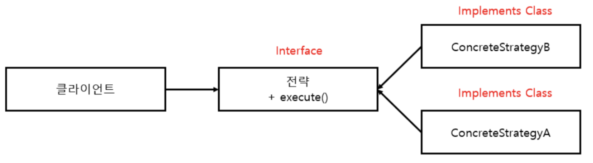
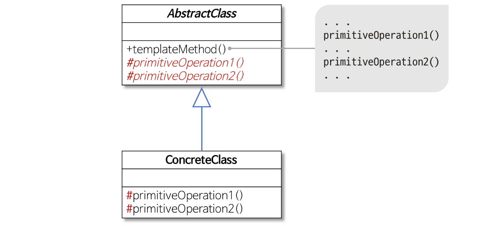
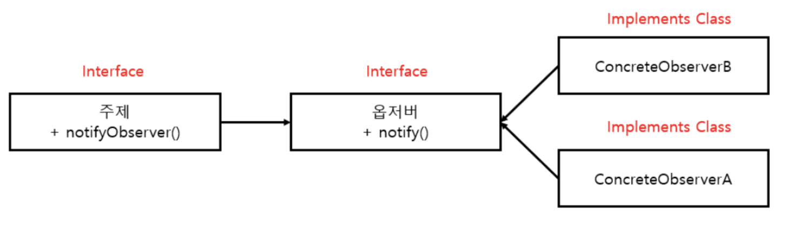
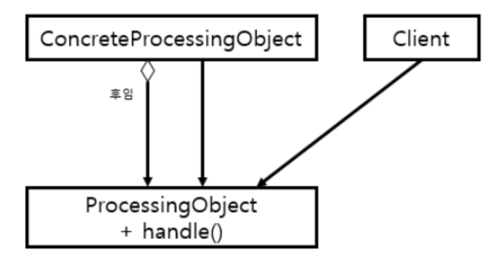

# 리팩터링, 테스팅, 디버깅
지금까지 배운 람다, 메서드참조, 스트림 등의 기능을 이용해서 더 가독성이 좋고 유연한 코드로 리팩터링 하는 방법에 대하여 알아본다.
1. [가독성과 유연성을 개선하는 리팩터링](#91-가독성과-유연성을-개선하는-리팩터링)
2. [람다로 객체지향 디자인 패턴 리팩터링 하기](#92-람다로-객체지향-디자인-패턴-리팩터링-하기)
3. [람다 테스팅](#93-람다-테스팅)
4. [디버깅](#94-디버깅)
 
## 9.1 가독성과 유연성을 개선하는 리팩터링
코드 가독성을 개선한다는 것은 우리가 구현한 코드를 다른 사람이 쉽게 이해하고 유지보수 할수 있게 만드는 것을 의미한다.    

***코드 가독성 개선***
* 익명 클래스를 람다 표현식으로 리팩터링 하기
  * 익명 클래스에서 this는 익명 클래스 자신을 가리키지만 람다에서 this는 람다를 감싸는 클래스를 가리킨다.
  * 익명 클래스는 감싸고 있는 클래스의 변수를 가릴 수 있다.
  * 익명 클래스는 인스턴스화할 때 명시적으로 형식이 정해지는 반면 람다의 형식은 콘텍스트에 따라 달라진다.
* 람다 표현식을 메서드 참조로 리팩터링 하기  
* 명령형 데이터 처리를 스트림으로 리팩터링 하기  
>   📌 **코드 가독성 개선 예제코드**:  <a href="https://github.com/day0ung/ModernJavaInAction/blob/main/java_code/modern_java/src/chapter09/SourceCode091.java">SourceCode091</a>

***코드 유연성 개선***
* 함수형 인터페이스 적용 : 람다 표현식을 이용하면 동작 파라미터화(behavior parameterzation)를 쉽게 구현할 수 있다. 람다 표현식을 사용하기 위해 함수형 인터페이스 적용해야 한다.
1. 조건부 연기 실행 : 코드 내부에 제어 흐름문이 복잡하게 얽힌 코드를 볼 수 있다. 불필요한 if문을 제거할 수 있으며 코드 가독성이나 캡슐화도 강화된다.
2. 실행 어라운드 : 매번 같은 준비, 종료 과정을 반복적으로 수행한다면 이를 람다로 변환할 수 있다.

## 9.2 람다로 객체지향 디자인 패턴 리팩터링 하기
디자인 패턴은 공통적인 소프트웨어 문제를 설계할 때 재사용할 수 있는 검증된 청사진을 제공한다.  
디자인패턴은 재사용할 수 있는 부품으로 여러가지 다리(현수교,아치교 등)를 건설하는 엔지니어링에 비유할수 있다. 아래 5가지 패턴을 알아본다.
* [전략패턴](#-전략-패턴)
* [템플릿 메서드](#-템플릿-메서드)
* [옵저버 패턴](#-옵저버-패턴)
* [의무 체인 패턴](#-의무-체인-패턴)
* [팩토리 패턴](#-팩토리-패턴)
### 📌 전략 패턴
전락패턴은 한 유형의 알고리즘을 보유한 상태에서 런타임에 적절한 알고리즘을 선택하는 기법이다. 
알고리즘을 정의하고, 해당 알고리즘을 사용하는 클래스와 분리하여 독립적으로 변경하거나 다른 알고리즘으로 교체할 수 있도록 한다.  
다양한 기준을 갖는 입력값을 검증하거나, 다양한 파싱 방법을 사용하거나, 입력 형식을 설정하는 등 다양한 시나리오에 전략 패턴을 활용할 수 있다
> 
> * 알고리즘을 나타내는 인터페이스(Strategy 인터페이스)
> * 다양한 알고리즘을 나타내는 한개 이상의 인터페이스 구현(ConcreteStrategyA, ConcreteStrategyB)
> * 전략 객체를 사용하는 한개 이상의 클라이언트
> 
> 💡 **전략 패턴은 코드 재사용성을 높이고, 유연성과 확장성을 제공하는 디자인 패턴 중 하나**  
> 전략 패턴은 객체가 수행해야 할 행위를 캡슐화하여 동적으로 교체할 수 있는 디자인 패턴, 전략 패턴은 인터페이스를 통해 여러 개의 알고리즘을 정의하고, 클라이언트에서 필요에 따라 선택하여 실행할 수 있다
> >  **전략패턴 예제코드**:  <a href="https://github.com/day0ung/ModernJavaInAction/blob/main/java_code/modern_java/src/chapter09/StrategyPattern.java">StrategyPattern</a>

### 📌 템플릿 메서드
미리 정의된 알고리즘의 구조를 정의하고, 일부 단계의 구체적인 구현을 서브 클래스에서 제공하여 전체 알고리즘을 완성하는 방식으로 작동한다.  
알고리즘의 개요를 제시한 다음에 알고리즘의 일부를 고칠 수 있는 유연함을 제공해야할때 사용한다. "이 알고리즘을 사용하고 싶은데, 그대로는 안돼고 조금 고쳐야하는 상황"에 적합  
전략 패턴은 동작을 변경할 수 있는 코드이며, 템플릿 메서드 패턴은 구조를 변경할 수 있는 코드이다.
> 
> * 즉, 전체적으로는 동일하면서 부분적으로는 다른 구문으로 구성된 메서드의 코드 중복을 최소화 할 때 유용하다.
> * 다른 관점에서 보면 동일한 기능을 상위 클래스에서 정의하면서 확장/변화가 필요한 부분만 서브 클래스에서 구현할 수 있도록 한다.
> * 예를 들어, 전체적인 알고리즘은 상위 클래스에서 구현하면서 다른 부분은 하위 클래스에서 구현할 수 있도록 함으로써 전체적인 알고리즘 코드를 재사용하는 데 유용하도록 한다.  
> 역할이 수행하는 작업
> * AbstractClass
>   * 템플릿 메서드를 정의하는 클래스
>   * 하위 클래스에 공통 알고리즘을 정의하고 하위 클래스에서 구현될 기능을 primitive 메서드 또는 hook 메서드로 정의하는 클래스
> * ConcreteClass
>   * 물려받은 primitive 메서드 또는 hook 메서드를 구현하는 클래스
>   * 상위 클래스에 구현된 템플릿 메서드의 일반적인 알고리즘에서 하위 클래스에 적합하게 primitive 메서드나 hook 메서드를 오버라이드하는 클래스
>   
> 💡**어떤 작업을 처리하는 일부분을 서브 클래스로 캡슐화해 전체 일을 수행하는 구조는 바꾸지 않으면서 특정 단계에서 수행하는 내역을 바꾸는 패턴**
> >  **템플릿 메서드 패턴 예제코드**  
> >  <a href="https://github.com/day0ung/ModernJavaInAction/blob/main/java_code/modern_java/src/chapter09/TemplateMethodPattern.java">TemplateMethodPattern</a>  
> >  <a href="https://github.com/day0ung/ModernJavaInAction/blob/main/java_code/modern_java/src/chapter09/TemplateMethodPatternLambda.java">TemplateMethodPatternLambda</a>

### 📌 옵저버 패턴
옵저버 패턴은 객체들 간의 일대다 의존 관계를 정의하는 패턴 중 하나이다. 이 패턴에서는 하나의 주체 객체(Subject)와 이 객체를 관찰하는 다수의 옵저버 객체(Observer)로 구성되며 주체 객체의 상태가 변경되면, 주체 객체는 등록된 모든 옵저버에게 상태 변경을 통지한다.  
각 옵저버는 이 통지를 받아서 자신의 상태를 변경하거나, 특정 작업을 수행하는 등의 처리를 수행할 수 있다.
> 
>  💡**어떤 이벤트가 발생 했을때 한 객체(subject)가 다른 객체(observer) 리스트에 자동으로 상태 변경을 통지해야할때 사용**
> > **옵저버 패턴 예제코드** : <a href="https://github.com/day0ung/ModernJavaInAction/blob/main/java_code/modern_java/src/chapter09/ObserverPattern.java">ObserverPattern</a>

### 📌 의무 체인 패턴
작업 처리 객체의 체인(동작 체인 등)을 만들 때는 의무체인 패턴을 사용한다. 한 객체가 어떤 작업을 처리한 다음에 다른 객체로 결과를 전달하고,  
다른 객체도 해야할 작업을 처리한 다음에 또 다른 객체로 전달하는 식이다.  
의무 체인 코드는 객체의 체인 형태를 띄며, 객체들은 각자의 처리 작업을 수행하고 다음 객체를 호출한다. 이 때, 객체는 작업을 수행하고 작업 수행에 실패하면, 예외를 발생시키며 호출자에게 작업 수행 실패를 알린다.  
이런 방식으로, 객체들은 서로에 대한 의존성을 갖지 않으면서도 작업을 처리할 수 있다.
> 
> * 그림을 자세히 보면 템플릿 베서드 디자인 패턴이 사용되었음을 할수 있다. handle()메서드는 일부 작업을 어떻게 처리해야할지 전체적으로 기술한다.
> * ProcessingObject 클래서를 상속받아 handleWork메서드를 구현하여 다양한 종류의 작업처리 객체를 만들 수 있다. 
> 
> 💡 **다수의 객체가 처리해야 하는 작업을 하나씩 처리하며, 처리할 객체를 연결해가며 처리하는 패턴**
> > **의무체인 패턴 예제코드** : <a href="https://github.com/day0ung/ModernJavaInAction/blob/main/java_code/modern_java/src/chapter09/ChainOfResponsibilityPattern.java">ChainOfResponsibilityPattern</a>

 
### 📌 팩토리 패턴
인스턴스화 로직을 클라이언트에 노출하지 않고 객체를 만들 때 팩토리 디자인 패턴을 사용한다.
> ~~~java
> final static Map<String, Supplier<Product>> map = new HashMap<>();
>   static {
>   map.put("loan", Loan::new);
>   map.put("stock", Stock::new);
>   map.put("bond", Bond::new);
>  }
> ~~~
> 분기문을 통해 상황에 맞는 객체를 만들어 전달하는 것 대신 input을 키 Supplier를 값으로 갖는 Map을 만들고, 그리고 Supplier로는 생성자 메서드 참조를 사용하여 팩토리 패턴을 사용할 수 있다.  
> 💡**팩토리 패턴은 객체 생성과 관련된 복잡한 로직을 캡슐화하여 코드의 가독성, 유지보수성, 확장성을 높인다.**
> > **팩토리 패턴 예제코드** : <a href="https://github.com/day0ung/ModernJavaInAction/blob/main/java_code/modern_java/src/chapter09/FactoryPattern.java">FactoryPattern</a>

## 9.3 람다 테스팅
개발자의 최종업무 목표는 깔끔한 코드를 구현하는 것이아닌, 제대로 작동하는 코드를 구현하는 것이다.  
프로그램이 의도대로 동작하는지 확인할 수 있는 **단위 테스팅**을 진행한다.
하지만 람다는 익명이므로 테스트 코드 이름을 호출할 수 없다. 대신 람다 표현식은 함수형 인터페이스의 인스턴스를 생성한다. 따라서 인스턴스의 동작으로 람다 표현식을 테스트할 수 있다.  

* 람다의 목표는 정해진 동작을 다른 메서드에서 사용할 수 있도록 하나의 조각으로 캡슐화하는 것이다. 그러려면 세부 구현을 포함하는 람다 표현식을 공개하지 말아야 한다.
* 결국 람다에 대한 테스팅은 세세한 람다의 동작 스텝 과정마다의 산출물이 아닌 전체 람다 표현식에 대하여 입력한 input과 기대하는 output이 잘 반환되는지에 대한 테스트가 필요하다.
* 복잡한 람다 표현식이라면 개별 메서드로 분할하여 테스트 단위를 잘게 쪼개는 것이다. 또한 함수를 인수로 받거나 다른 함수를 반환하는 메서드라면 테스트 내에서 또 다른 람다를 사용해서 테스트하자.

> **테스팅 예제코드** : <a href="https://github.com/day0ung/ModernJavaInAction/blob/main/java_code/modern_java/src/chapter09/SourceCode093.java">SourceCode093</a>

## 9.4 디버깅
문제가 발생한 코드를 디버깅 할때 개발자는 다음 두가지를 먼저 확인해야한다.  
* 스택 트레이스
* 로깅
하지만 람다 표현식과 스트림은 기존의 디버깅 기법을 무력화한다.

### 스택 트레이스 확인

람다 표현식은 이름이 없기 때문에 조금 복잡한 스택 트레이스가 생성된다. 그렇기에 람다 표현식과 관련된 스택 트레이스는 이해하기 어려울 수 있다. 이는 미래의 자바 컴파일러가 개선해야 할 부분이다.

### 정보 로깅
forEach를 통해 스트림 결과를 출력하거나 로깅할 수 있다. 하지만 forEach는 스트림을 소비하는 연산이다. 스트림 파이프라인에 적용된 각각의 연산의 결과를 확인할 수 있다면 대신 peek라는 스트림 연산을 활용할 수 있다.  
peek는 스트림의 각 요소를 소비한것 처럼 동작을 실행하지만, 실제로 스트림을 소비하지않고 자신이 확인한 요소를 파이프라인의 다음 연산으로 그대로 전달한다.

> **스택 트레이스, 정보로깅 예제코드** : <a href="https://github.com/day0ung/ModernJavaInAction/blob/main/java_code/modern_java/src/chapter09/SourceCode094.java">SourceCode094</a>