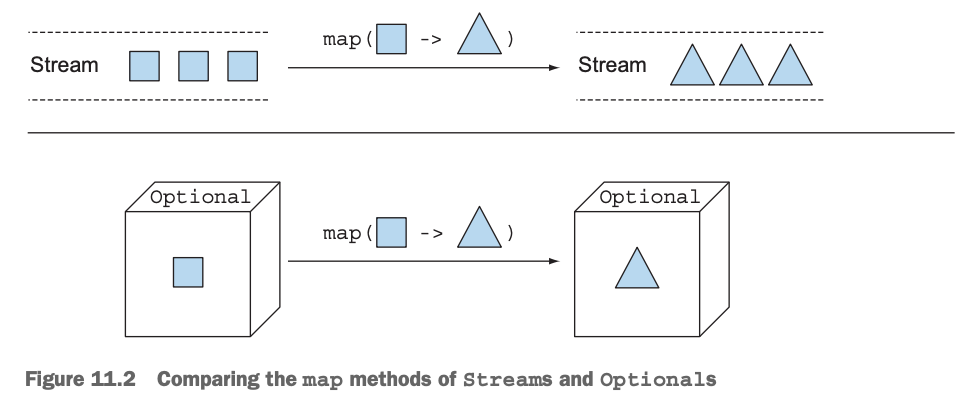
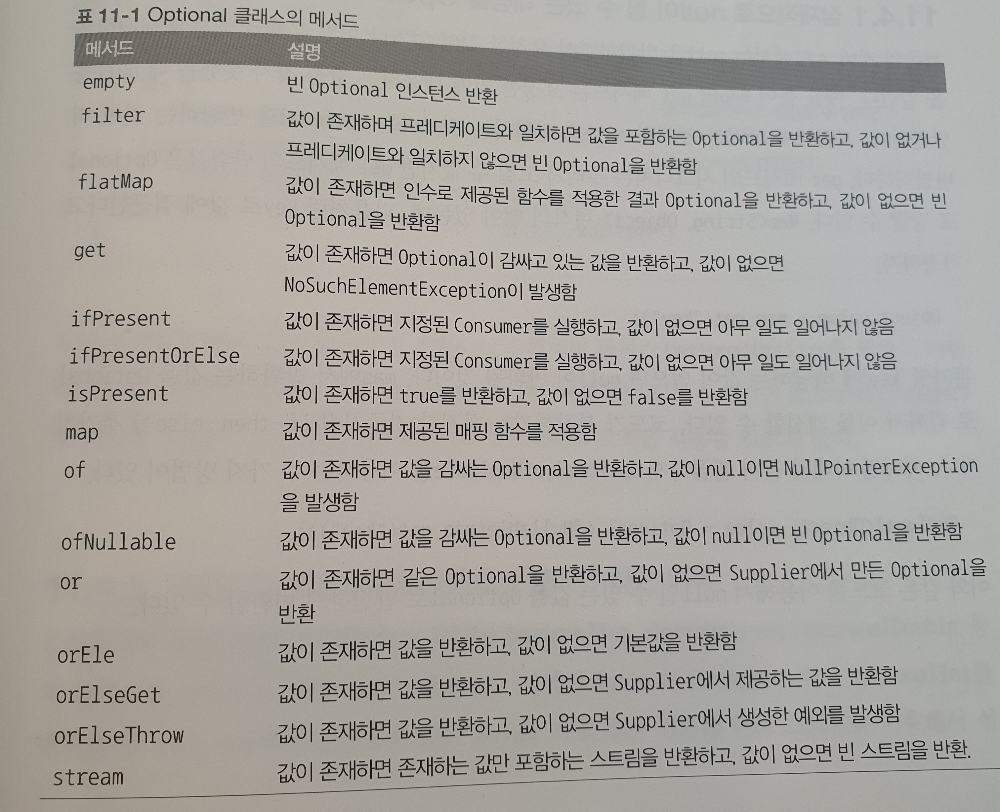

# null대신 Optional 클래스

## 11.1 값이 없는 상황을 어떻게 처리할까?
#### 보수적인 자세로 NullPointerException 줄이기
필요한 곳에 다양한 null 확인 코드를 추가해서 NullPointerException문제를 해결한다. 변수에 접근할 때마다 중첩된 if가 추가되면서 코드 들여쓰기 수준이 증가한다. 이와 같은 반복 패턴(recurring pattern) 코드를 **깊은 의심(deep doubt)** 이라 부른다.  
다른 방법으로 중첩 if 블록을 없애고 둘 이상의 출구를 두는 방식이 있다. 하지만 이와 같은 경우 출구 때문에 유지보수가 어려워질 수 있다.
~~~java
//안전시도 1: 깊은 의심
public String getCarInsuranceName(Person person){
        if (person != null){
            Car car = person.getCar();
            if(car != null){
                Insurance insurance = car.getInsurance();
                if(insurance != null){
                return insurance.getName();
                }
            }
        }
        return "Unknown";
}

//안전시도 2: 너무 많은 출구
public String getCarInsuranceName(Person person){
        if (person != null){
            return "Unknown";
        }
        Car car = person.getCar();
        if (car != null){
            return "Unknown";
        }

        Insurance insurance = car.getInsurance();
        if (insurance != null){
            return "Unknown";
        }
        return insurance.getName();
}

//null 확인 코드로 나머지 호출 체인의 들여쓰기 수준이 증가한다.
~~~

### null 때문에 발생하는 문제
* 에러의 근원 : NullPointerException에는 자바에서 가장 흔하게 발생하는 에러이다.
* 코드를 어지럽힌다 : 중첩된 null 확인 코드를 추가해야 하므로 null 때문에 코드 가독성이 떨어진다.
* 아무 의미가 없다 : null은 아무 의미도 표현하지 않는다. 값이 없음을 표현하는 방식으로는 적절하지 않다.
* 자바 철학에 위배된다 : 자바는 개발자로부터 모든 포인터를 숨겼다. 하지만 null 포인터는 예외이다.
* 형식 시스템에 구멍을 만든다 : 모든 참조 형식에 null을 할당할 수 있다. 이런 식으로 null이 할당되기 시작하면서 시스템의 다른 부분으로 null이 퍼졌을 때 애초에 null이 어떤 의미로 사용되었는지 알 수 없다.
> 다른 언어의 null 대체재
> Groovy에서는 안전 내비게이션 연산자(safe navigation operator) ?.를 도입해서 null문제를 해결했다.  
>  > <code> def carInsuranceName = person?.car?.insurance?.name </code>

## 11.2 Optional 클래스 소개
* Java 8은 하스켈과 스칼라의 영향을 받아 java.util.Optional이라는 클래스를 도입했다.
* Optional은 선택형 값을 캡슐화 하는 클래스이며 값이 있으면 Optional 클래스는 값을 감싸고 값이 없으면 Optional.empty 메서드로 Optional 객체를 반환한다.
* 반면 값이 없으면 Optional.empty 메서드로 Optional을 반환한다. Optional.empty는 Optional의 특별한 싱글턴 인스턴스를 반환하는 정적 팩토리 메서드이다.

* null참조와 Optional.empty에는 차이가 있다. null을 참조하려하면 NullPointerException이 발생하지만 Optional.empty()는 Optional 객체이므로 이를 다양한 방식으로 활용할 수 있다.

Optional 클래스를 사용하면 모델의 의미(semantic)가 더 명확해진다. 변수가 Optional일 경우 그 값을 가질 수도 있으며 가지지 않을 수도 있다는 것을 의미한다. Optional의 역할은 더 이해하기 쉬운 API를 설계하도록 돕는 것이다. 즉, 메서드의 시그니처만 보고도 선택형값인지 여부를 구별할 수 있다. Optional이 등장하면 이를 unwrap해서 값이 없을 수 있는 상황에 적절하게 대응하도록 강제하는 효과가 있다.

## 11.3 Optional 적용 패턴
###  Optional 객체 만들기
* 빈 Optional
    * <code>Optional<Car> optCar = Optional.empty()</code>

* null이 아닌 값으로 Optional 만들기
  * ~~~java
      Optional<Car> opCar = Optional.of(car);
      car가 null이라면 즉시 NullPointException이 발생한다.
      ~~~

* null값으로 Optional 만들기
  * ~~~java
    Optional<Car> optCar = Optional.ofNullable(car);
    car가 null이면 빈 Optional 객체가 반환된다.
    ~~~

### 맵으로 Optional의 값을 추출하고 변환하기
보통 객체의 정보를 추출할 때는 opional을 사용할 때가 많다.  
~~~java
Optional<Insurance> optionalInsurance = Optional.ofNullable(insurance);
Optional<String> name = optionalInsurance.map(Insurance::getName);
~~~
> Optional의 map 메서드는 4장, 5장에서 살펴본 스트림의 map 메서드와 개념적으로 비슷하다. 

> Optional이 값을 포함하면 map의 인수로 제공된 함수가 값을 바꾼다. 비어있으면 아무런 일도 일어나지 않는다.  
> 위 그림은 스트림과 Optional에서 사각형을 삼각형으로 변형하는 함수를 map메서드에 적용했을때 어떤일이 일어나는지 보여준다.

### flatMap으로 Optional객체 연결
위에서 살펴본 예제를 통해 map 메서드로 반환되는 값은 Optional로 감싸짐을 확인할 수 있었다.  
그렇다면 반환하는 객체가 이미 Optional 객체일 경우 반환되는 타입이 Optional<Optional>이다. 이때 두번 감싸진 Optional로 받고 싶지 않다면 flatMap 메서드를 사용하자. Optional의 flatMap 메서드는 전달된 Optional 객체의 요소에 대해 새로운 Optional로 반환해준다.
> **예제코드** : <a href="https://github.com/day0ung/ModernJavaInAction/blob/main/java_code/modern_java/srcchapter/11/SourceCode113.java">SourceCode113.getCarInsuranceNameUseFlatMap()</a>

> 💡**도메인 모델에 Optional을 사용했을 때 데이터를 직렬화할 수 없는 이유** 
> Optional 클래스는 필드 형식으로 사용할 것을 가정하지 않았으므로 Serializable 인터페이스를 구현하지 않았다.  
> 따라서 도메인 모델에 Optional을 사용한다면 직렬화 모델을 사용하는 도구나 프레임워크에서 문제가 생길 수 있다. 만약 직렬화 모델이 필요하다면 변수는 일반 객체로 두되, Optional로 값을 반환받을 수 있는 메서드를 추가하는 방식이 권장된다.
> ~~~java
> public class Person {
>	private Car car;
>	public Optional<Car> getCarAsOptional() {
>		return Optional.ofNullable(car);
>	    }
> }
> ~~~

### Optional 스트림 조작
자바9에서는 Optional을 포함하는 스트림을 쉽게 처리할 수있도록 Optional에 stream()메서드를 추가했다.  

 
위 연산을 거친 결과 Stream<Optional<String>>형태를 얻는데 중간 객체가 Null 인경우 값이 비어있을수 있다.
다음 처럼 filter를 활용해 완전한 결과를 얻을 수 있도록 구현하자.
> **예제코드** : <a href="https://github.com/day0ung/ModernJavaInAction/blob/main/java_code/modern_java/src/chapter11/SourceCode113.java">SourceCode113.getCarInsuranceNames()</a>  
~~~java
Stream<Optional<String>> optionalStream = persons.stream()
                                                .map(Person::getCar)
                                                .map(optCar -> optCar.flatMap(Car::getInsurance))
                                                .map(optInsurance -> optInsurance.map(Insurance::getName));
Set<String> collect = optionalStream.filter(Optional::isPresent)
                                    .map(Optional::get)
                                    .collect(Collectors.toSet());
~~~

### 디폴트 액션과 Optional 언랩
* get()
  * get()은 값을 읽는 가장 간단한 메서드 이며 동시에 가장 안전하지 않다.
  * get()을 사용하는 경우 래핑된 값이 있으면 값을 리턴하지만 값이 없으면 NoSuchElementException을 반환 한다.
  * 따라서 Optional에 값이 반드시 있다고 가정할 수 있는 상황이 아니라면 get 메서드를 사용하지 않는 것이 바람직하다.
* orElse(T other)
  * orElse를 사용하면 Optional이 값을 포함하지 않을 경우 기본값을 제공할 수 있다.
* orElseGet(Supplier<? extends T> other)
  * orElse 메서드에 대응하는 lazy 버전이다. Optional에 값이 없을때만 Supplier가 실행된다.
  * 디폴트 메서드를 만드는데 시간이 걸리거나 Optional이 비어있을때만 기본값을 생성하고 싶은 경우 사용한다.
* orElseThrow(Supplier<? extends T> other)
  * Optional이 비어 있을때 예외를 발생시킨다는 점에서 get메서드와 비스하다.
* ifPresent(Consumer<? super T> consumer)
  * ifPresent를 이용하면 값이 존재할 때 인수로 넘겨준 동작을 실행할 수 있다.
* ifPresentOrElse(Consumer<? super T> action, Runnable emptyAction)
  * Java 9 버전에 추가된 이 메서드는 Optional이 비어있을때 실행할 수 있는 Runnable을 인수로 받는다는 점만 ifPresent와 다르다.

### 두 Optional 합치기 
Optional에서 map과 flatMap은 Optional이 비어있다면 빈 Optional을 반환한다. 두 Optional에 대한 연산을 map과 flatMap을 적절히 활용하여 수행할 수 있다.  
두 Optional인수를 활용하여 연산을 해야하는 경우를 살펴보자.
~~~java
public Optional<Insurance> nullSafeFindCheapestInsurance(Optional<Person> person, Optional<Car> car) {
    if (person.isPresent() && car.isPresent()) {
        return Optional.of(new Insurance());
    }
    return Optional.empty();
}
~~~
isPresent 메서드를 활용해서 Optional이 비엇는지 확인후 필요한 연산을 진행했다.
> **예제코드** : <a href="https://github.com/day0ung/ModernJavaInAction/blob/main/java_code/modern_java/src/chapter11/SourceCode113.java">SourceCode113.nullSafeFindCheapestInsurance()</a>  

이 코드는 null 검사 코드와 크게 다를 것 이 없다. 조금더 개선해보자.

### 필터로 특정값 거르기
스트림과 비슷하게 Optional 객체에 filter 메서드를 통하여 특정 조건에 대해 거를 수 있다.  

객체의 프로퍼티를 확인해야 하는 경우 객체가 Null인지 확인한 다음 메서드를 실행해야 한다.
~~~java
Insurance insurance = ....;
if (insurance != null && "XXX".equals(insurance.getName())) {
  ...
}
~~~
* Optional객체에 filter 메서드를 이용해 다음과 같이 코드를 재구현 할 수 있다.
* ~~~java
  Optional<Insurance> optInsurance = ...;
  optInsurance.filter(insurance -> "XXX".equals(insurance.getName()))
  .ifPresent(x -> ...);
  // Optional에 값이 있으면 filter연산을 실행할 것이고 값이 없으면 아무 연산도 실행하지 않는다.
  ~~~
  
> 💡Optional 클래스의 메서드
> 

## 11.4 Optional을 사용한 실용 예제
잠재적으로 null이 될 수 있는 대상을 Optional로 감싸기
* 기존 자바 API에서는 null을 반환하며 요청한 값이 없거나 계산이 실패했음을 알렸다.
* map.get("key") 는 키에 해당하는 값이 map에 없으면 null을 반환하게 되었다.
* 기존처럼 if - then - else를 추가하거나 Optional.ofNullable을 사용할 수 있다.

예외와 Optional 클래스
* 자바 API 에서는 어떤 이유에서 값을 제공할 수 없을때 예외를 발생했다.
* Integer.parseInt와 같은 예를 보면 문자열을 정수로 반환할수 없는 경우 NumberFormatException을 반환 한다.
* 이러한 경우를 Optional을 활용해 개선해보자

~~~java
// 문자열을 정수 Optional로 반환 하는 메서드
public static Optional<Integer> stringToInt(String s) {
  try {
    return Optional.of(Integer.parseInt(s));
  } catch (NumberForamtException e) {
    return Optional.empty();
  }
}

이러한 유틸리티클래스 OptionalUtility를 만들고 사용하면 try/catch같은 거추장스러운 로직을 사용할 필요가 없다
~~~