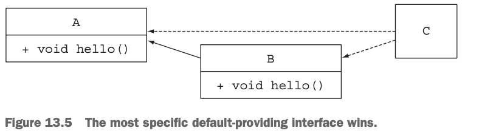
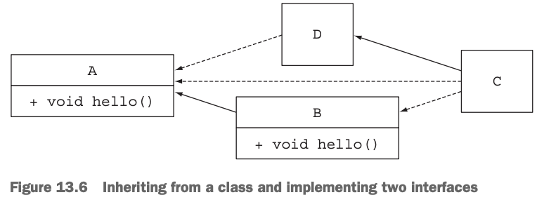
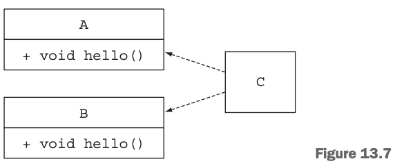
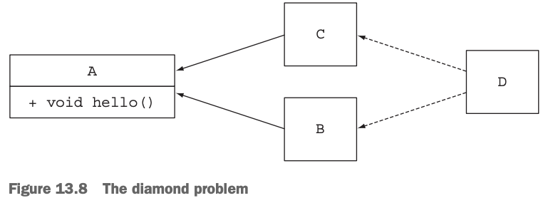

# 디폴트 메서드 
자바 8에서는 기본 구현을 포함하는 인터페이스를 정의하는 두가지 방법을 제공한다.  
첫번째는 인터페이스 내부에 **정적메서드**를 사용하는 것이다. 두 번째는 인터페이스의 기본 구현을 제공할 수 있도록 **디폴트 메서드** 기능을 사용하는 것이다.

결과적으로 기존 인터페이스를 구현하는 클래스는 자동으로 인터페이스에 추가된 새로운 메서드의 디폴트 메서드를 상속받게 된다. 
이렇게 하면 기존의 코드 구현을 바꾸도록 강요하지 않으면서도 인터페이스를 바꿀 수 있다.
> 💡 정적메서드와 인터페이스  
> 보통 자바에서는 인터페이스 그리고 인터페이스의 인스턴스를 활용할 수 있는 다양한 정적 메서드를 정의하는 유틸리티 클래스를 제공한다.    
> 자바 8에서는 인터페이스에 직접 정적 메서드를 선언할 수 있으므로 유틸리티 클래스를 없애고 
> 직접 인터페이스 내부에 정적 메서드를 구현할 수 있다.  
> 그럼에도 불구하고 과거 버전과의 호환성을 유지할 수 있도록 자바 API에는 유틸리티 클래스가 남아 있다. 
## 13.1 변화하는 API
이미 릴리즈된 인터페이스를 고치면 어떤 문제가 발생하는지 더 자세히 살펴보며 API를 변경하는것이 왜 어려운지에 대해 예제를 통해 알아보자.

#### API 버전 1
Resizable 인터페이스 초기 버전은 다음과 같은 메서드를 지원한다.
~~~java
public interface Resizable extends Drawable {
  int getWidth();
  int getHeight();
  void setWidth(int width);
  void setHeight(int height);
  void setAbsoluteSize(int width, int height);
}
~~~
#### API 버전 2
요구사항의 변화로 Resizable 에 메서드가 추가되었다고 가정하자.
~~~java
public interface Resizable extends Drawable {
  int getWidth();
  int getHeight();
  void setWidth(int width);
  void setHeight(int height);
  void setAbsoluteSize(int width, int height);
  void setRelativeSize(int wFactor, int hFactor);
}
~~~
**사용자가 겪는 문제**  
* Resizable을 고치면 Resizable을 구현하는 모든 클래스는 추가된 메소드 또는 변경된 메소드를 구현해야 한다.
* 인터페이스에 새로운 메서드를 추가하면 바이너리 호환성은 유지되지만 컴파일 단계에서 에러가 발생할 것이다
* 공개된 API를 고치면 기존 버전과의 호환성 문제가 발생했다. 디폴트 메서드가 나온 이후로는 이러한 문제들을 해결할 수 있게 되었다.

> 💡 호환성
> * 바이너리 호환성 : 뭔가를 바꾼 이후에도 에러 없이 기존 바이너리가 실행될 수 있는 상황.
> * 소스 호환성 : 코드를 고쳐도 기존 프로그램을 성공적으로 재컴파일할 수 있는 상황.
> * 동작 호환성 : 코드를 바꾼 다음에도 같은 입력값이 주어지면 프로그램이 같은 동작을 실행하는 상황.
## 13.2 디폴트 메서드란 무엇인가?
Java8에서는 호환성을 유지하면서 API를 바꿀수 있도록 새로운 기능인 디폴트 메서드를 제공한다.  
이제 인터페이스는 자신을 구현하는 클래스에서 메서드를 구현하지 않을 수 있는 새로운 메서드 시그니처를 제공한다.  
 * 그럼 디폴트 메서드는 누가 구현할까?
   * 인터페이스를 구현하는 클래스에서 구현하지 않은 메서드는 인터페이스 자체에서 기본으로 제공한다. (그래서 디폴트 메서드)
   * 디폴트 메서드는 default라는 키워드로 시작하며 다른 클래스에 선언된 메서드 처럼 메서드 바디를 포함한다. 
     * ~~~java
       public interface Sized{
          int size();
          default boolean isEmpty(){  //디폴트 메서드
              return size() ==0;
          }  
       }
     
       //Sized인터페이스를 구현하는 모든 클래스는 isEmpty의 구현도 상속받는다.
       ~~~
   * 즉, 인터페이스에 디폴트 메서드를 추가하면 소스 호환성이 유지된다.
 * 인터페이스가 구현을 가질수 있고 클래스는 여러 인터페이스를 동시에 구현할 수 있으므로 결국 자바도 다중상속을 지원하는가? (13.4에서.해결)
 * 인터페이스를 구현하는 클래스가 디폴트 메서드와 같은 메서드 시그니처를 정의하거나 아니면 디폴트 메서드를 오버라이드 한다면? (13.4에서.해결)

> 💡 추상클래스와 자바 8의 인터페이스의 차이점
> 추상 클래스와 인터페이스 둘다 추상메서드와 바디를 포함하는 메서드를 정의할 수 있다. 
 * 클래스는 하나의 추상 클래스만 상속받을 수 있지만 인터페이스를 여러 개 구현할 수 있다.
 * 추상 클래스는 인스턴스 변수(필드)로 공통 상태를 가질 수 있다. 하지만 인터페이스는 인스턴스 변수를 가질 수 없다. 

## 13.3 디폴트 메서드 활용 패턴
디폴트 메서드를 이용하는 두 가지 방식은 선택형 메서드(optional method)와 동작 다중 상속(multiple inheritance of behavoir)이다.

### 선택형 메서드
자바 8 등장이전 인터페이스를 구현하는 클래스는 사용하지 않는 메서드에 대해 비어있는 메서드까지 필수적으로 구현해주어야 했다.   
하지만 디폴트 메서드를 이용하면 메서드의 기본 구현을 인터페이스로부터 제공받기 때문에 빈 구현을 제공할 필요가 없다. 이를 통해 불필요한 코드의 양을 줄일 수 있다.

### 동작 다중 상속
디폴트 메서드를 이용하면 기존에는 불가능 했던 동작 다중 삭송 기능도 구현할 수 있다.  
* 그림 [단일상속과 다중 상속]
* 

자바에서는 한개의 클래스 상속만 가능하지만 인터페이스는 여러 개를 구현할 수 있도록 되어 있다.
```java
public class ArrayList<E> extends AbstractList<E> implements List<E>, RandomAeccess, Cloneable, Serialiizable {
                                //한개의 클래스를 상속           //4개의 인터페이스 구현
}
```

* ***다중 상속 형식***
  * ArrayList는 AbstractList, List, RandomAeccess, Cloneable, Serialiizable의 서브 형식이 된다.
  * Java8 에서는 인터페이스가 구현을 포함할 수 있으므로 클래스는 여러 인터페이스에서 동작을 상속받을 수 있다. 중복되지 않는 최소한의 인터페이스를 유지한다면 재사용과 조합을 쉽게 할 수 있다.
* ***기능이 중복되지 않는 최소의 인터페이스***
  * 기존의 코드를 재사용하며 새로운 기능을 제공할때 디폴트 메서드를 활용할 수 있다.
  * ~~~java 
    interface Rotatable {
      void setAngle(int angle);
      int getAngle();
    default void rotateBy(int angle) {
      setAngle((getAngle() + angle) % 360);
     }
    }
    ~~~
  * 위 인터페이스는 템플릿 메서드 패턴과 비슷해보인다. 템플릿 메서드 패턴은 추상 클래스를 상속 받아 구현하게 되어 다중상속이 불가능 하다는 차이점이 있다.
* ***인터페이스 조합***
  * 여러 인터페이스를 조합하여 기존 기능들을 재사용할 수 있다.
  * ~~~java 
    public class Monster implements Rotatable, Moveable, Resizable {}
    ~~~
  * Monster 클래스는 3가지 인터페이스의 디폴트 메서드를 자동으로 상속 받는다. 움직일수 있고, 회전가능하며 크기도 조절할 수 있는 클래스가 되었다.
  * 인터페이스에 디폴트 구현을 포함하면 또 다른 장점이 생긴다. 특정 요구사항이 변경되었을 경우 해당하는 인터페이스의 디폴트 메서드만 변경하면 상속 받는 모든 클래스에 요구사항이 반영된다.

## 13.4 해석규칙
자바의 클래스는 하나의 부모 클래스만 상속받을 수 있지만, 어려 인터페이스를 동시에 구현할 수 있다.  
자바 8에는 디폴트 메서드가 추가되었으므로 같은 시그니처를 갖는 디폴트 메서드를 받는 상황이 생길 수 있다. 이런 상황에서는 어떤 인터페이스의 디폴트 메서드를 사용하게 될까?  
> **예제코드** : <a href="https://github.com/day0ung/ModernJavaInAction/blob/main/java_code/modern_java/src/chapter13/SourceCode134.java">SourceCode134</a>

### 알아야 할 세가지 해결 규칙 
1. **클래스가 항상 이긴다.** 클래스나 슈퍼 클래스에서 정의한 메서드가 디폴트 메서드보다 우선권을 갖는다.
2. **1번 규칙 이외의 상황에서는 서브 인터페이스가 이긴다.** 상속관계를 갖는 인터페이스에서 같은 시그니처를 갖는 메서드를 정의할 때는 서브 인터페이스가 이긴다. 즉 B가 A를 상속받는다면 B가 A를 이긴다.
3. 디폴트 메서드의 우선순위가 결정되지 않았다면 여러 **인터페이스를 상속받는 클래스가 명시적으로 디폴트 메서드를 오버라이드하고 호출**해야 한다.

### 디폴트 메서드를 제공하는 서브인터페이스가 이긴다. 
* 디폴트 메서드를 제공하는 가장 하위의 서브인터페이스가 이긴다.(13.5)
  * 
  * 인터페이스 A, B가 존재하며 클래스 C가 B와 A를 구현한다고 할때 C에서 호출하는 hello는 2번 규칙에 따라 B의 hello가 실행된다.
* 하나의 클래스를 상속받아 두개의 인터페이스를 구현(13.6)
  * 
  * ~~~java
    public class D implements A { }
    public class C extends D implements B, A {
    public static void main(String... args) {
       new C().hello();
    }
    }
    ~~~
  * 클래스 D는 hello를 오버라이드하지 않았고 단순히 인터페이스 A를 구현했다. 따라서 D는 인터페이스 A의 디폴트 메서드 구현을 상속받는다. 2번 규칙에 따라 클래스나 슈퍼클래스에 메서드 정의가 없을 때는 디폴트 메서드를 정의하는 서브인터페이스가 선택된다. 따라서 컴파일러는 인터페이스 A와 B의 hello 중 하나를 선택하는데 B가 A를 상속받는 관계이므로 B의 hello가 실행된다.
  * 만약 D가 hello를 오버라이드 했다면 클래스인 D가 슈퍼 클래스의 메서드를 정의된 것이기 때문에 D의 hello가 실행된다

### 충돌 그리고 명시적인 문제해결
그림 13.5와달리 이번 케이스는 **B가 A를 상속받지 않는 상황**이라고 가정

인터페이스간의 상속관계가 없으므로 2번규칙을 적용할 수 없다. 그러므로 컴파일에 에러가 발생한다.  
```java
public interface A {
	default void hello() { ... }
}

public interface B {
	default void hello() { ... }
}

public class C implements B, A { }
```
충돌해결
* ```java
  public class C implements B, A {
    void hello() {
        B.super.hello(); //명시적으로 인터페이스 B의 메서드를 선택한다.
    }
  }
  ```
  
#### 다이아몬드 문제 
다이어그램이 다이아몬드를 닮았으므로 이를 **다이아몬드 문제**라 부른다. 

```java

public interface A {
	default void hello() { ... }
}

public interface B extends A { }
public interface C extends A { }

public class D implements B, C { 
	public static void main(String... args) {
		new D().hello();
	}
}

```

다이어그램의 모양이 다이아몬드를 닮아 다이아몬드 문제라 부른다. D가 구현하는 B와 C 중 선택할 수 있는 메서드는 오직 A의 디폴트 메서드 뿐이다. D는 A의 hello를 호출한다.

만약 B에 같은 디폴트 메서드 hello가 있었다면 가장 하위의 인터페이스인 B의 hello가 호출될 것이다. B와 C가 모두 디폴트 메서드를 정의했다면 디폴트 메서드 우선순위로 인해 에러가 발생하고 명시적인 호출이 필요하게된다.

> 만약 C에서 디폴트 메서드가 아닌 추상메서드 hello를 추가하면 어떻게 될까?
> ```java
> public interface C extends A {
> void hello();
> }
> ```
> C는 A를 상속받으므로 C의 추상 메서드 hello가 A의 디폴트 메서드 hello보다 우선권을 갖는다. 따라서 B와 C중 선택하지 못하며 컴파일에러가 발생한다.