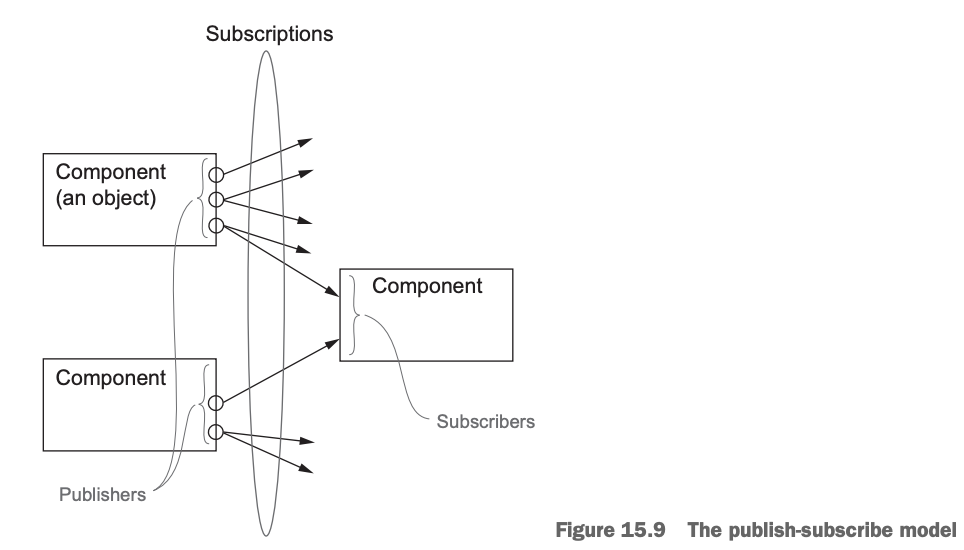

# CompletableFuture와 리액티브 프로그래밍 컨셉의 기초
최근(2019년 기준) 소프트웨어개발 개발 방법을 획기적으로 뒤집는 두 가지 추세로,  
1. 애플리케이션을 실행하는 하드웨어관련:  
   멀티코어 프로세서가 발전하면 애플리케이션의 속도는 멀티코어 프로세서를 얼마나 잘 활용할 수 있도록 소프트웨어를 개발하는가에 달라질 수 있다.
2. 애플리케이션을 어떻게 구성하는지 관련(특히 상호작용):  
   마이크로서비스 아키텍처 선택이 증가하게되며 독립적으로만 동작하는 웹사이트가 아닌 다양한 소스의 콘텐츠를 가져와 합치는 메시업 형태를 띄게된다. 이를 위해 여러 웹 서비스에 접근해야 하는 동시에 서비스의 응답을 기다리는 동안 연산이 블록되거나 귀중한 CPU 클록 사이클 자원을 낭비하지 않아야 한다. 특히 스레드를 블록함으로 연산 자원을 낭비하는 일은 피해야 한다.

이를 위해 자바 8에서는 Future인터페이스를 구현한 CompletableFuture 클래스를 제공하며, 자바 9에서는 발행 구독 프로코톨에 기반한 리액티브 프로그래밍 개념을 따르는 플로 API를 제공한다.
> 💡**동시성(Concurrency) vs 병렬성(Parallelism)**  
>    
>  동시성은 단일 코어 머신에서 발생할 수 있는 프로그래밍 속성으로 실행히 서로 겹칠 수 있는 반면,  
> 병렬성은 병렬 실행을 하드웨어 수준에서 지원한다. 

## 15.1 동시성을 구현하는 자바 지원의 진화
* 초기 자바 : Runnable과 Thread를 동기화된 클래스와 메서드를 이용하여 잠궜다
* 자바 5 : 스레드 실행과 태스트 제출을 분리하기 위한 ExecutorService 인터페이스, 높은 수준의 결과 즉 Runnable과 Thread의 변형을 반환하는 Callable과 Future, 제네릭
* 자바 7 : 분할 정복 알고리즘의 포크/조인 구현을 지원하는 java.util.concurrent.RecursiveTask
* 자바 8 : 스트림과 새로 추가된 람다 지원에 기반한 병렬 프로세싱. Future를 조합하는 기능을 추가하며 동시성을 강화한 CompletableFuture
* 자바 9 : 분산 비동기 프로그래밍을 지원. 리액티브 프로그래밍을 위한 Flow 인터페이스 추가

### 스레드와 높은 수준의 추상화
* 일반적으로 프로세스는 운영체제에 한개 이상의 스레드 즉, 본인이 가진 프로세스와 같은 주소 공간을 공유하는 프로세스를 요청함으로 테스트클 동시에 또는 협력적으로 실행할 수 있다.
* 이전에 스트림을 활용하여 외부 반복(명시적 루프) 대신 내부 반복을 통해 병렬 프로그래밍을 하는 방법을 배웠다. 결론적으로 병렬 스트림의 반복은 명시적인 스레드를 사용하는 것에 비해 높은 수준의 개념이라는것을 알 수 있다.
* 정리 하자면,  직접 Thread를 사용하지 않고 스트림을 이용해 스레드 사용 패턴을 추상화할 수 있다. 스트림으로 추상화하는것은 디자인 패턴을 적용하는 것과 비슷하지만 대신 쓸모 없는 코드가 라이브러리 내부로 구현되면서 복잡성도 줄어든다는 장점이 더해진다.
### Executor와 스레드 풀
***스레드의 문제***  
* 자바 스레드는 직접 운영체제 스레드에 접근한다. 운영체제 스레드를 만들고 종료하려면 비싼비용(페이지 테이블과 관련한 상호작용)을 치러야 한다.  
* 운영체제가 지원하는 스레드 수를 초과해 사용하면 자바 애플리케이션이 예상치 못한 방식으로 크래시될 수 있으므로 기존 스레드가 실행되는 상태에서 계속 새로운 스레드를 만드는 상황이 일어나지 않도록 주의해야한다.
* 보통 운영체제와 자바의 스레드 개수가 하드웨어 스레드 개수 보다 많으므로 일부 운영체제 스레드가 블록되거나 자고있는 상황에서  
* 모든 하드웨어 스레드가 코드를 실행하도록 할당된 상황에 놓을 수 있다. 프로그램에서 사용할 최적의 자바 스레드 개수는 사용할 수 있는 하드웨어 코어의 개수에 따라 달라진다.  

***스레드 풀 그리고 스레드 풀이 더 좋은 이유***  
* 자바 ExcutorService는 테스크를 제출하고 나중에 결과를 수집할 수 있는 인터페이스를 제공한다.  
* 스레드 풀은 일정한 수의 워커 스레드를 가지고 있다. 스레드 풀에서 사용하지 않은 스레드로 제출된 태스크를 먼저 온 순서대로 실행한다. 이들 태스크 실행이 종료되면 스레드 풀로 반환한다. 
* 이 방식의 장점은 하드웨어에 맞는 수의 태스크를 유지함과 동시에 수 천개의 태스크를 스레드 풀에 아무 오버헤드 없이 제출할 수 있다는 점이다.  

***스레드 풀 그리고 스레드 풀이 나쁜 이유***  
거의 모든 관점에서 스레드를 직접 사용하는 것보다 스레드 풀을 이용하는 것이 바람직 하지만 두 가지 사항을 주의해야 한다.

* k 스레드를 가진 스레드 풀은 오직 k만큼의 스레드를 동시에 실행할 수 있다. 이때 잠을 자거나 I/O를 기다리거나 네트워크 연결을 기다리는 태스크가 있다면 주의해야 한다. 이런 상황에서 스레드는 블록되며, 블록 상황에서 태스크가 워커 스레드에 할당된 상태를 유지하지만 아무 작업도 하지 않게 된다.
* 핵심은 블록할 수 있는 태스크는 스레드 풀에 제출하지 말아야 한다는 것이지만 항상 이를 지킬 수 있는 것은 아니다
* 프로그램을 종료하기 전에 모든 스레드 풀을 종료하자. 자바는 이런 상황을 위해 Thread.setDaemon 메서드를 제공한다.  
* > 자는 태스크는 스레드 풀의 성능을 저하시킨다.
  > 
  >  세 태스크가 잠들거나 블록되큐에 포함된 15개 테스크는
  >  나머지 두 워커가 실행될때 까지 기다려야 하므로 병렬 실행 성능이 저하됨
  > 
***스레드의 다른 추상화: 중첩되지 않은 메서드 호출***  
테스크나 스레드가 메서드 호출 안에서 시작되면 그 메서드 호출은 반환하지 않고 작업이 끝나기를 기다리는 방식 즉 스레드 생성과 join이 한쌍처럼 중첩된 메서드 호출내에 추가되는 것을 ***엄격한 포크 / 조인*** 이라 부른다.  
시작된 테스크를 내부 호출이 아니라 외부 호출에서 종료하도록 기다리는 좀더 여유로운 방식의 포크/조인을 사용해도 비교적 안전하다. ***(여유로운 포크/조인)*** 

## 15.2 동기 API와 비동기 API
7장에서 자바8 스트림을 이용해 명시적으로 병렬 하드웨어를 이용할 수 있음을 설명했다.
두가지 단계로 병렬성을 이용할 수 있다.  
* 외부반복(명시적 for-loop)을 내부반복(스트림 메서드 이용)으로 바꿔야한다.
* 스트림 parallel()메서드를 이용하므로 자바 런타임 라이브러리가 복잡한 스레드 작업을 하지 않고 병렬로 요소가 처리되도록 한다. 

> Thread와 ExecutorService 예제
> 메서드가 병렬적으로 실행되는 예제를 살펴보자.
> > **예제코드** : <a href="https://github.com/day0ung/ModernJavaInAction/blob/main/java_code/modern_java/src/chapter15/SourceCode152.java">SourceCode152</a>  
> 
> * ThreadExample 예제에서 별도의 스레드로 f,g를 구현할 수 있지만 코드가 복잡하다.  
> * Runnable대신 Future API 인터페이스를 활용해 단순화 한것이 ExecutorServiceExample이지만,  
> 이 코드도 명시적인 submit 메서드 호출 같은 불필요한 코드가 있다.  
> 
> 문제의 해결은 **비동기 API**기능으로 API를 바꿔서 해결할 수 있다. 
> * 첫번째 방법, Future를 활용하면 문제를 조금 개선할 수 있다.
> * 두번째 방법, Pub - Sub 기반 Flow 인터페이스를 활용 하여 구현할 수 있다.
#### Future 형식 API
대안을 이용하면 f,g의 시그니처가 아래 처럼바뀐다.
~~~java
Future<Integer> f(int x);
Future<Integer> g(int x);
//호출시
Future<Integer> y = f(x);
Future<Integer> z = g(x);
System.out.println(y.get() + z.get());
~~~
* 메서드 f는 호출 즉시 자신의 원래 바디를 평가하는 테스크를 포함하는 Futrure를 반환
* get 메서드를 이용하여 두 Future가 완료되어 결과가 합쳐지기를 기다린다.
#### 리액티브 형식 API
두번째 대안에서 핵심은 f,g의 시그니처를 바꿔서 콜백 형식의 프로그래밍을 이용하는 것이다.
```java
void f (int x, IntConsumer dealWithResult);
```
<sup>f가 값일 반환하지 않는데 어떻게 동작할까? f에 추가 인수로 콜백(람다)를 전달해 바디에 return 하는게 아니라  
결과가 준비되면 이를 람다로 호출하는 테스크 만드는 것이 비결이다.</sup>
> > **예제코드** : <a href="https://github.com/day0ung/ModernJavaInAction/blob/main/java_code/modern_java/src/chapter15/SourceCode152.java">SourceCode152</a>  
> 위 예제 reactiveAPIExample()메서드 에서, 기용한 계산은 합계를 정확하게 알 수 없다. 어떤 함수가 먼저 계산될지 알수 없기 때문이다.

예제코드 문제를 보완하기 위해  
* if-then-else조건문을 이용해 적절하게 락을 걸어 두 콜백이 모두 호출되었는지 판단한다.
* 리액티브 형식의 API는 보통 한 결과가 아니라 일련의 이벤트에 반응하도록 설계되었으므로 Future를 사용하는것이 적절하다.  

두 대안 모두 코드를 복잡하게 만들며 어떤 API를 사용할지 결정이 필요하다.
API는 명시적으로 스레드를 처리하는 코드에 비해 사용코드를 더 단순하게 만들고, 높은 수준의 구조를 유지할 수 있게 도와준다.

### 잠자기(그리고 기타 블로킹동작)는 해로운 것으로 간주
* 스레드는 잠들어도(sleep()) 여전히 시스템 자원을 점유한다. 
* 스레드를 단지 몇개 사용하는 상황에서는 큰 문제가 아니지만, 스레드가 많아지고 그중 대부분이 잠을 잔다면 문제가 있다. 
* 스레드 풀에서 잠을 자는 테스크는 다른 테스크가 시작되지 못하기 막으므로 자원을 소비한다(운영 체제가 이들 테스크를 관리하므로 일단 스레드로 할당된 테스크는 중지시키지 못한다.)   
* 모든 블록 동작도 마찬가지다. 
* 블록동작은 다른 테스크가 어떤 동작을 완료하기를 기다리는 동작(Future.get())과 외부 상호작용(DB I/O)동작으로 구분한다. 

```java
//코드 A
work1(); 
Thread.sleep(10000); <- 10초간 슬립
work2(); 

//코드 B
main() {
  ScheduledExecutorService scheduledExecutorService = Executors.newScheduledThreadPool(1);
  work1();
  //work1()이 끝난다음 10초뒤에 work2()를 개별 테스크로 스케쥴
  scheduledExecutorService.schedule(ScheduledExecutorServiceExample::work2, 10, TimeUnit.SECONDS);
  scheduledExecutorService.shutdown();
}
```
* 코드 A
  * 스레드 풀 큐에 추가되며 나중에 차례가 되면 실행된다.
  * 코드가 실행되면 워커 스레드를 점유한 상태에서 아무것도 하지않고 10초를 잔다.
  * 깨어나서 work2를 실행한 다음 작업을 종료하고 워커 스레드를 해제한다.
* 코드 B
  * work1을 실행하고 종료한다. 하지만 work2가 10초 뒤에 실행 될수 있도록 큐에 추가한다.

코드 B가 더 좋은점은?
A가 자는 동안 스레드 자원을 점유하는 반면 B는 다른 작업이 실행될 수 있도록 허용한다. 
### 비동기 API에서 예외는 어떻게 처리하는가?
* Future를 구현한 CompletableFuture에서는 런타임 get 메서드에 예외를 처리할 수 있는 기능을 제공, exceptionally와 같은 메서드도 제공된다.
* 리액티브 형식의 비동기 API에서는 return 대신 콜백이 호출되므로 에러시 호출할 콜백 함수를 전달해주면 된다.
* 콜백이 여러개 인경우 한 객체로 메서드를 감싸는 것이 좋다. Java 9 Flow API에서는 여러 콜백을 한 객체(네 개의 콜백을 감싸는 Subscriber)로 감싼다.
## 15.3 박스와 채널 모델
박스와 채널 모델(box-and-channel model)은 동시성 모델을 설계하고 개념화하기 위한 모델을 말한다.  
박스와 채널 모델로 대규모 시스템 구현의 추상화 수준을 높일 수 있다. 

 * 이전 예제 f(x) + g(x)의 계산을 일반화하면 f나 g를 호출하거나 p 함수에 인수 x를 이용해 호출하고 그 결과를 q1과 q2에 전달하며 두 호출의 결과를 r을 호출한다.
 * ```java
    // 아래코드는 q1과 q2를 차례로 호출하여 병렬성 활용과는 거리가 멀다.
    int t = p(x);
    print(r(q1(t), q2(t)));
   
   // Future를 활용하여 f, g를 병렬로 호출하였다.
    int t = p(x);
    Future<Integer> a1 = executorService.submit(() -> q1(t));
    Future<Integer> a2 = executorService.submit(() -> q2(t));
    print(r(a1.get(), a2.get()));
    ```
 * 이 예제에서는 p, r은 다른 작업보다 먼저 선행되고 마지막에 실행되어야 하기 때문에 Future로 감싸지 않았다. 하지만 병렬성을 극대화 하려면 모든 작업을 Future로 감싸야 한다.
## 15.4 CompletableFuture와 콤비네이터를 이용한 동시성
Java 8에서는 Future 인터페이스의 구현인 CompletableFuture를 이용하여 Future를 조합할 수 있는 기능을 추가했다.  
일반적으로 Future는 실행하여 get()으로 결과를 얻을 수 있는 Callable로 만들어진다. 하지만 CompletableFuture는 실행할 코드 없이 Future를 만들수 있고 complete() 메서드를 활용하여 나중에 어떤 값을 이용해 다른 스레드가 이를 완료할 수 있고 get()으로 결과를 얻을수 있도록 허용한다.  

* f(x)와 g(x)를 동시에 실행하 합계를 구하는 코드
* > **예제코드** : <a href="https://github.com/day0ung/ModernJavaInAction/blob/main/java_code/modern_java/src/chapter15/SourceCode154.java">SourceCode154</a>


CompletableFuture<T>에 thenCombine 메서드는 두개의  CompletableFuture 값(T,U 결과 형식)을 받아 한개의 새값을 만든다.
```java
public <U,V> CompletableFuture<V> thenCombine(
        CompletionStage<? extends U> other,
        BiFunction<? super T,? super U,? extends V> fn) {
        return biApplyStage(null, other, fn);
    }
```

> <sup>책에는 없지만 알아보는 Future vs CompletableFuture 차이점 정리</sup>
> * Future
>   * 계산이 완료될 때까지 블로킹 메서드를 사용하여 결과를 기다리는 방식으로 작동
>   * 또한 Future는 계산 결과를 쿼리하는 메서드를 제공하지만, 계산이 완료될 때까지 블로킹
> * CompletableFuture
>   * Future와 마찬가지로 비동기 계산의 결과를 나타내지만, 결과가 계산되기를 기다리는 블로킹 방식이 아니라, 콜백 함수를 등록하여 계산이 완료되면 자동으로 실행되도록 설계
>   * CompletableFuture는 Future보다 더 많은 기능을 제공하며 CompletableFuture는 Future와 달리 비동기 작업의 중간 결과를 처리하는 데 사용할 수 있는 다양한 메서드를 제공합니다. 또한 CompletableFuture는 Future와 달리 계산 결과가 불확실한 경우 예외 처리를 위한 메서드를 제공
>   * CompletableFuture는 더 강력한 비동기 프로그래밍 도구로, Future보다 더 많은 유연성과 기능을 제공

## 15.5 발행 - 구독 그리고 리액티브 프로그래밍
Future와 CompletableFuture는 독립적 실행과 병렬성이라는 정식적 모델에 기반한다.  
연산이 끝나면 get()으로 Future의 결과를 얻을 수 있다. 따라서 Future는 **한번만** 실행히 결과를 제공한다  

반면 리액티브 프로그래밍은 시간이 흐르면서 여러 Future같은 객체를 통해 여러 결과를 제공한다. 
ex) 온도계 객체는, 매초 마다 온도 값을 반복적으로 제공한다. 또다른 예로 리스너 객체는 네트워크에 HTTP요청이 발생하길 기다렸다가 이후에 결과 데이터를 생산한다.  
그리고 다른 코드에서 온도값 또는 네트워크 결과를 처리한다.   
* 두 예시(온도계, 리스너)는 Future같은 동작이 사용되었다. 한번의 결과가 아니라 여러번의 결과가 필요하다
* 온도계 예시는 한번의 결과가 아니라 여러번의 결과가 필요하며, 가장 최근의 온도가 필요하다
* 이런 종류의 프로그래밍을 리액티브라 부른다. 
* 왜냐하면 낮은 온도를 감지 했을때 이에 **반응(react)** 하는 부분이 존재하기 때문이다

자바 9에서 java.util.concurrent.Flow의 인터페이스에 발행-구독 모델(pub-sub)을 적용해 리액티브 프로그래밍을 제공한다.  
자바 9 플로API는 간단히 세가지 플로 API로 정리할수 있다.  
* **구독자** 가 구독할 수 있는 **발행자**
* 이연결을 **구독**(subscription)이라 한다. 
* 이연결을 이용해 메시지(또는 이벤트)를 전송한다.
* (그림설명 발행자-구독자 모델)
  * 

#### 두 플로를 합치는 예제
두 정보 소스로 부터 발행하는 이벤트를 합쳐서 다른 구독자가 볼수 있도록 발행하는 예제,
<sup>이 기능은 수식을 포함하는 스프레드 시트의 셀헤서 흔히 제공하는 동작이다 </sup>  
"=C1 +C2"라는 공식을 포함하는 스프레드 시트 셀 C3을 만들자, C1이나 C2의 값이 갱신되면 C3에도 새로운 값이 반영된다.  

> **예제코드** : <a href="https://github.com/day0ung/ModernJavaInAction/blob/main/java_code/modern_java/src/chapter15/SourceCode155.java">SourceCode155</a>
> >💡업스트림과 다운스트림  
> > 데이터가 발행자(생산자)에서 구독자(소비자)로 흐름을 착안해 개발자는 이를 업스트립 또는 다운스트림이라 부른다.  
> > 위예제에서 데이터 newValue는 업스트림 onNext()메서드로 전달되고 notifyAllSubscribers()호출을 통해 다운스트림 onNext()로 호출된다. 

#### 역압력 
매 초마다 수천개의 메시지가 onNext로 전달된다면 빠르게 전달되는 이벤트를 아무 문제 없이 처리할 수 있을까? 이러한 상황을 압력(pressure)이라 부른다.

이럴때는 정보의 흐름 속도를 제어하는 역압력 기법이 필요하다. 이것은 데이터 소비자가 느리게 처리되거나 처리할 수 없을 때 데이터 생산자가 생성하는 데이터 양을 제한하는 것을 의미  
역압력은 Subscriber가 Publisher로 정보를 요청할 때만 전달할수 있도록 한다.
* 자바 9 플로 API에서는 발행자가 무한의 속도고 아이템을 방출하는 대신 요청했을 때만 다음 아이템을 보내도록 하는 request() 메서드를 제공한다.

Publisher와 Subscriber 사이에 채널이 연결되면 첫 이벤트로 Subscriber.onSubscribe(Subscription subscription)메서드가 호출된다.  
Subscription 객체는 다음처럼 Subscriber와 Publisher와 통신할 수 있는 메서드를 포함한다.
```java
interface subscription {
  void cancle ();
  void request (long n);
}
```
****실제 역압력의 간단한 형태****  
한 번에 한 개의 이벤트를 처리하도록 발행-구독 연결을 구성하기 위해 다음과 같은 작업이 필요하다

* Subscriber가 OnSubscribe로 전달된 Subscription 객체를 필드로 저장.
* Subscriber가 수많은 이벤트를 받지 않도록 onSubscribe, onNext, onError의 마지막 동작에 channel.request(1)을 추가해 오직 한 이벤트만 요청한다.
* 요청을 보낸 채널에만 onNext, onError 이벤트를 보내도록 Publisher의 notifyAllSubscribers 코드를 바꾼다.
* 보통 여러 Subscriber가 자신만의 속도를 유지할 수 있도록 Publisher는 새 Subscription을 만들어 각 Subscriber와 연결한다.

* 역압력을 구현하려만 여러가지 장단점을 생각해야 한다.
  * 여러 Subscriber가 있을 때 이벤트를 가장 느린 속도로 보낼 것인가? 아니면 각 Subscriber에게 보내지 않은 데이터를 저장할 별도의 큐를 가질 것인가?
  * 큐가 너무 커지면 어떻게 해야할까?
  * Subscriber가 준비가 안 되었다면 큐의 데이터를 폐기할 것인가?
이런 결정은 데이터의 성격에 따라 달라진다.
  
## 15.6 리액티브 시스템 vs 리액티브 프로그래밍
#### 리액티브 시스템
* 런타입 환경이 변화에 대응하도록 전체 아키텍처가 설계된 프로그램.
* 반응성(responsive), 회복성(resilient), 탄력성(elastic)으로 세 가지 속성을 가진다.
* 반응성은 리액티브 시스템이 큰 작업을 처리하느라 간단한 질의의 응답을 지연하지 않고 실시간으로 입력에 반응하는 것이다.
* 회복성은 한 컴포넌트의 실패로 전체 시스템이 실패하지 않음을 의미한다.
* 탄력성은 시스템이 잣긴의 작업 부하에 맞게 적응하며 작업을 효율적으로 처리함을 의미
#### 리액티브 프로그래밍
* 리액티브 시스템이 가지는 속성을 구현하기 위한 프로그래밍 형식을 의미한다.
* java.util.concurrent.Flow 관련된 자바 인터페이스에서 제공하는 리액티브 프로그래밍 형식.
* 이들 인터페이스 설계는 메시지 주도(message-driven) 속성을 반영한다.

정리하자면 리액티브 시스템은 전체적인 리액티브 환경 아키텍처를 의미하며 리액티브 프로그래밍은 리액티브 환경을 위해 사용하는 프로그래밍 기법이다. 리액티브 프로그래밍을 이용해 리액티브 시스템을 구현할 수 있다.