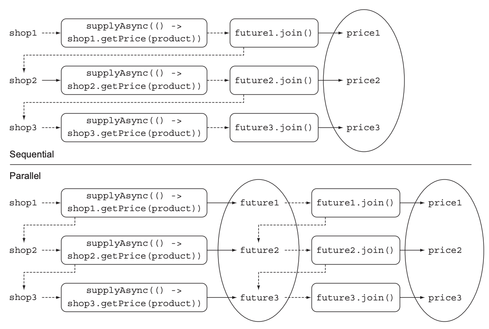

# CompletableFuture : 안정적 비동기 프로그래밍
## 16.1 Future의 단순활용
시간이 걸릴 수 있는 작업을 Future 내부로 설정하면 호출자 스레드가 결과를 기다리는 동안 다른 작업을 할 수 있다.  
Future 작업은 ExecutorService에서 제공하는 스레드에서 처리되고,
작업의 결과가 필요한 시점에 Future의 get 메서드로 결과를 가져올 수 있다.  
하지만 get 메서드를 호출했을 때 결과가 준비되어있지 않다면 작업이 완료될 때까지 스레드를 블록시킨다.  
> **예제코드** : <a href="https://github.com/day0ung/ModernJavaInAction/blob/main/java_code/modern_java/src/chapter16/SourceCode161.java">SourceCode161</a>
***Future 제한***  
Future 인터페이스에는 비동기 계산에 대한 대기와 결과 처리 메서드들이 있다. 하지만 여러 Future 간 의존성은 표현하기 어렵다.
> 그래서 자바8에서는 CompletableFuture 클래스로 다음과 같은 기능을 제공한다.
> * 두 개의 비동기 계산 결과를 합친다. 두 결과는 서로 독립적 또는 한쪽에 의존적일 수 있다.
> * Future 집합이 실행하는 모든 태스크의 완료를 기다린다.
> * Future 집합에서 가장 빨리 완료되는 태스크를 기다렸다가 결과를 얻는다.
> * 프로그램적으로 Future를 완료시킨다.(비동기 동작에서 수동으로 결과 제공)
> * Future 완료 동작에 반응한다.(결과를 기다리면서 블록되지 않음)

**CompletableFuture로 비동기 애플리케이션 만들기**  
어떤 제품이나 서비스를 이용하는 상황을 가정하고, 여러 온라인 상점중 가장 저렴한 가격을 제시하는 상점을 찾는 애플리케이션을 만들어보자  
> 아래에서 설명
> **예제코드** : <a href="https://github.com/day0ung/ModernJavaInAction/blob/main/java_code/modern_java/src/chapter16/application/.java">SourceCode161</a>

## 16.2 비동기 API 구현
* 동기 API : 메서드를 호출한 다음에 메서드가 계산을 완료할 때까지 기다렸다가 메서드가 반환되면 호출자는 반환된 값으로 계속 다른 동작을 수행. 블록 호출(blocking call)이라 한다.
* 비동기 API : 메서드가 즉시 반환되며 끝내지 못한 나머지 작업을 호출자 스레드와 동기적으로 실행될 수 있도록 다른 스레드에 할당한다. 비블록 호출(non-blocking call)이라 한다

최저가 검색 애플리케이션 구현하기 위해 먼저 각각의 상점에서 제공해야하는 API부터 정의해야한다. 
```java
public class Shop{
    public double getPrice(String product){
            //구현해야함
    }
}
```
getPrice 메서드는 상점의 데이터 베이스를 이용해서 가격 정보를 얻는 동시에 다른 외부서비스에도 접근할 것이다. 
#### 동기 메서드를 비동기 메서드로 변환
동기 메서드를 CompletableFuture를 통해 비동기 메서드로 변환할 수 있다. 비동기 계산과 완료 결과를 포함하는 CompletableFuture 인스턴스를 만들고 완료 결과를 complete 메서드로 전달하여 CompletableFuture를 종료할 수 있다.<sub> 예제코드 Shop.class getPriceAsync()</sub>  
비동기 API를 사용하는 예제를 확일할수 있다. 가격 계산이 끝나기 전에 getPriceAsync()가 바노한되는 사실을 확인할 수 있다. 
> **예제코드**   
> - <a href="https://github.com/day0ung/ModernJavaInAction/blob/main/java_code/modern_java/src/chapter16/application/Shop.java">Shop</a>  
> - <a href="https://github.com/day0ung/ModernJavaInAction/blob/main/java_code/modern_java/src/chapter16/application/ShopMain.java">ShopMain</a>

#### 에러 처리 방법
위 로직에서 가격을 계산하는 동안 에러가 발생한다면 어떻게 될까?

예외가 발생하면 해당 스레드에만 영향을 미치기 때문에 클라이언트는 get 메서드가 반환될 때까지 영원히 기다릴 수도 있다.  
따라서 타임아웃을 활용해 예외처리를 하고, completeExceptionally 메서드를 이용해 CompletableFuture 내부에서 발생한 에외를 클라이언트로 전달해야 한다.
```java
public Future<Double> getPriceAsync(String product) {
  CompletableFuture<Double> futurePrice = new CompletableFuture<>();
  new Thread(() -> {
    try {
      double price = calculatePrice(product);
      futurePrice.complete(price);
    } catch {
      futurePrice.completeExceptionally(ex); //에러를 포함시켜 Future를 종료
    }
  }).start();
  return futurePrice;
}
```
#### 팩토리 메서드 supplyAsync로 CompletableFuture만들기 
좀 더 간단하게 CompletableFuture를 만드는 방법도 있다.
```java
public Future<Double> getPriceAsync(String product) {
  return CompletableFuture.supplyAsync(() -> calculatePrice(product));
}
```
supplyAsync 메서드는 Supplier를 인수로 받아서 CompletableFuture를 반환한다.

ForkJoinPool의 Executor 중 하나가 Supplier를 실행하며, 두 번째 인수로 다른 Executor를 지정할 수도 있다.
## 16.3 비블록 코드 만들기
다음과 같은 상점 리스트가 있다.  
```java
List<Shop> shops = Arrays.asList(new Shop("BestPrice"),
                                 new Shop("LetsSaveBig"),
                                 new Shop("MyFavoriteShop"),
                                 new Shop("BuyItAll"));
```
그리고 다음처럼 제품명을 입력하면 상점 이름과 제품 가격 문자열을 반환하는 List를 구현해야 한다.
```java
public List<String> findPrices(String product);
```
스트림을 이용하면 원하는 동작을 구현할 수 있다
```java
public List<String> findPrices(String product) {
  return shops.stream()
    .map(shop -> String.format("%s price is %.2f", shop.getName(), shop.getPrice(product)))
    .collect(toList());
}
// 네 개의 상점에서 각각 가격을 검색하는 동안 블록되는 시간이 발생할 것이다.
```
#### 병렬 스트림으로 요청 병렬화하기
이제 네 개의 상점에서 병렬로 검색이 진행되므로 시간은 하나의 상점에서 가격을 검색하는 정도만 소요될 것이다.
```java
public List<String> findPrices(String product) {
  return shops.parallelStream()
    .map(shop -> String.format("%s price is %.2f", shop.getName(), shop.getPrice(product)))
    .collect(toList());
}
```
#### CompletableFutue로 비동기 호출 구현하기
이번에는 findPrices 메서드의 호출을 비동기로 바꿔보자.
```java
List<CompletableFuture<String>> priceFutures = 
  shops.stream()
    .map(shop -> CompletableFuture.suppltAsync(
      () -> String.format("%s price is %.2f", shop.getName(), shop.getPrice(product)))
    .collect(toList());
}
```
위 코드로 List<CompletableFuture<String>>를 얻을 수 있고, 리스트의 CompletableFuture는 각각 계산 결과가 끝난 상점의 이름 문자열을 포함한다.

하지만 우리는 List<String> 형식을 얻어야 하므로 모든 CompletableFuture의 동작이 완료되고 결과를 추출한 다음 리스트를 반환해야 한다.
```java
public List<String> findPrices(String product) {
  List<CompletableFuture<String>> priceFutures = 
    shops.stream()
      .map(shop -> CompletableFuture.suppltAsync(
        () -> shop.getName() + "price is " + shop.getPrice(product)))
      .collect(toList());
      
  return priceFutures.stream()
    .map(CompletableFuture::join) //모든 비동기 동작이 끝나길 대기
    .collect(toList());
}
```
두 map 연산을 하나의 스트림 처리 파이프라인이 아닌, 두 개의 파이프라인으로 처리했다는 사실에 주목하자.

스트림 연산은 게으른 특성이 있으므로 하나의 파이프라인으로 처리했다면 모든 가격 정보 요청 동작이 동기적, 순차적으로 이루어지게 된다.
*  Sequentail(순차), Parallel(병렬)
* 스트림의 게으름 때문에 순차 계산이 일어나는 이유와 순차 계산을 회피하는 방법
* CompletableFuture를 사용한 결과는 순차 방식보단 빠르지만 병렬 스트림보단 느리다. 어떻게 개선할 수 있을까?

#### 더 확장성이 좋은 해결방법
* 병렬 스트림 버전에서는 4개의 스레드에 4개의 작업을 병렬로 수행하면서 검색 시간을 최소화했다.
* 하지만 작업이 5개가 된다면, 4개 중 하나의 스레드가 완료된 후에 추가로 5번째 질의를 수행할 수 있다.
* CompletableFuture는 병렬 스트림에 비해 작업에 이용할 수 있는 Executor를 지정할 수 있다는 장점이 있다.
#### 커스텀 Executor 사용하기 
실제로 필요한 작업량을 고려한 풀에서 관리하는 스레드 수에 맞게 Executor를 만들면 좋을 것 같다.

풀에서 관리하는 스레드 수는 어떻게 결정할 수 있을까?
> 스레드 풀 크기조절
> Nthread = Ncpu * Ucpu * (1 + W/C)
> - Ncpu : Runtime.getRuntime().availableProcessors()가 반환하는 코어 수
> - Ucpu : 0과 1 사이의 값을 갖는 CPU 활용 비율
> - W/C : 대기시간과 계산시간의 비율

* 한 상점에 하나의 스레드가 할당될 수 있도록, 상점 수만큼 Executor를 설정한다.
* 서버 크래시 방지를 위해 하나의 Executor에서 사용할 스레드의 최대 개수는 100 이하로 설정한다.
```java
private final Executor executor = Executors.newFixedThreadPool(Math.min(shops.size(), 100), //상점 수만큼의 스레드를 갖는 풀 생성(0~100 사이)
    new ThreadFactory() {
  public Thread new Thread(Runnable r) {
    Thread t = new Thread(r);
    t.setDeamon(true); //프로그램 종료를 방해하지 않는 데몬 스레드 사용
    return t;
  }
});

```
우리가 만드는 풀은 데몬 스레드를 포함한다. 자바에서 일반 스레드가 실행중이면 자바 프로그램은 종료되지 않는다.  
데몬 스레드를 사용하면 자바 프로그램이 종료될 때 강제로 스레드 실행이 종료될 수 있다.

> 스트림 병렬화와 CompletableFuture 병렬화
> * I/O가 포함되는 않은 계산 중심의 동작을 실행할 때는 스트림 인터페이스가 가장 구현하기 간단하며 효율적일 수 있다.
> * I/O를 기다리는 작업을 병렬로 실행할 때는 CompletableFuture가 더 많은 유연성을 제공하며, 대기/계산의 비율에 적합한 스레드 수를 설정할 수 있다. 스트림의 게으른 특성 때문에 스트림에서 I/O를 실제로 언제 처리할지 예측하기 어려운 문제도 있다.
## 16.4 비동기 작업 파이프라인 만들기
## 16.5 CompletableFuture의 종료에 대응하는 방법
