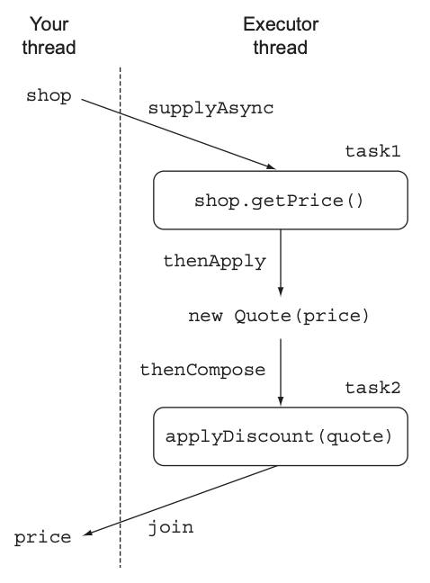
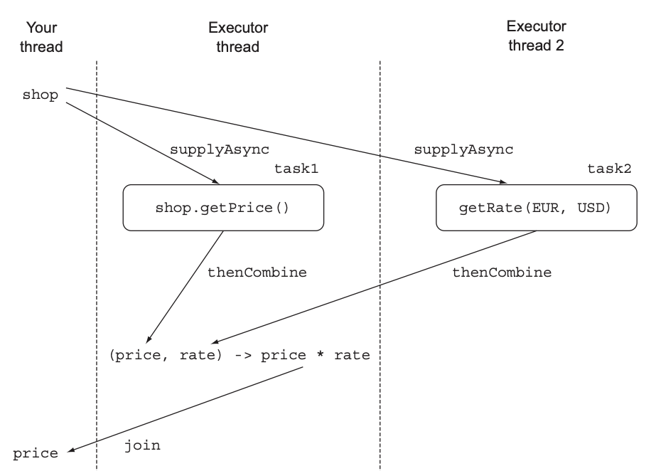

# CompletableFuture : 안정적 비동기 프로그래밍
## 16.1 Future의 단순활용
시간이 걸릴 수 있는 작업을 Future 내부로 설정하면 호출자 스레드가 결과를 기다리는 동안 다른 작업을 할 수 있다.  
Future 작업은 ExecutorService에서 제공하는 스레드에서 처리되고,
작업의 결과가 필요한 시점에 Future의 get 메서드로 결과를 가져올 수 있다.  
하지만 get 메서드를 호출했을 때 결과가 준비되어있지 않다면 작업이 완료될 때까지 스레드를 블록시킨다.  
> **예제코드** : <a href="https://github.com/day0ung/ModernJavaInAction/blob/main/java_code/modern_java/src/chapter16/SourceCode161.java">SourceCode161</a>
***Future 제한***  
Future 인터페이스에는 비동기 계산에 대한 대기와 결과 처리 메서드들이 있다. 하지만 여러 Future 간 의존성은 표현하기 어렵다.
> 그래서 자바8에서는 CompletableFuture 클래스로 다음과 같은 기능을 제공한다.
> * 두 개의 비동기 계산 결과를 합친다. 두 결과는 서로 독립적 또는 한쪽에 의존적일 수 있다.
> * Future 집합이 실행하는 모든 태스크의 완료를 기다린다.
> * Future 집합에서 가장 빨리 완료되는 태스크를 기다렸다가 결과를 얻는다.
> * 프로그램적으로 Future를 완료시킨다.(비동기 동작에서 수동으로 결과 제공)
> * Future 완료 동작에 반응한다.(결과를 기다리면서 블록되지 않음)

**CompletableFuture로 비동기 애플리케이션 만들기**  
어떤 제품이나 서비스를 이용하는 상황을 가정하고, 여러 온라인 상점중 가장 저렴한 가격을 제시하는 상점을 찾는 애플리케이션을 만들어보자  
> 아래에서 설명
> **예제코드** : <a href="https://github.com/day0ung/ModernJavaInAction/blob/main/java_code/modern_java/src/chapter16/application/.java">SourceCode161</a>

## 16.2 비동기 API 구현
* 동기 API : 메서드를 호출한 다음에 메서드가 계산을 완료할 때까지 기다렸다가 메서드가 반환되면 호출자는 반환된 값으로 계속 다른 동작을 수행. 블록 호출(blocking call)이라 한다.
* 비동기 API : 메서드가 즉시 반환되며 끝내지 못한 나머지 작업을 호출자 스레드와 동기적으로 실행될 수 있도록 다른 스레드에 할당한다. 비블록 호출(non-blocking call)이라 한다

최저가 검색 애플리케이션 구현하기 위해 먼저 각각의 상점에서 제공해야하는 API부터 정의해야한다. 
```java
public class Shop{
    public double getPrice(String product){
            //구현해야함
    }
}
```
getPrice 메서드는 상점의 데이터 베이스를 이용해서 가격 정보를 얻는 동시에 다른 외부서비스에도 접근할 것이다. 
#### 동기 메서드를 비동기 메서드로 변환
동기 메서드를 CompletableFuture를 통해 비동기 메서드로 변환할 수 있다. 비동기 계산과 완료 결과를 포함하는 CompletableFuture 인스턴스를 만들고 완료 결과를 complete 메서드로 전달하여 CompletableFuture를 종료할 수 있다.<sub> 예제코드 Shop.class getPriceAsync()</sub>  
비동기 API를 사용하는 예제를 확일할수 있다. 가격 계산이 끝나기 전에 getPriceAsync()가 바노한되는 사실을 확인할 수 있다. 
> **예제코드**   
> - <a href="https://github.com/day0ung/ModernJavaInAction/blob/main/java_code/modern_java/src/chapter16/example162/Shop.java">Shop</a>  
> - <a href="https://github.com/day0ung/ModernJavaInAction/blob/main/java_code/modern_java/src/chapter16/example162/ShopMain.java">ShopMain</a>

#### 에러 처리 방법
위 로직에서 가격을 계산하는 동안 에러가 발생한다면 어떻게 될까?

예외가 발생하면 해당 스레드에만 영향을 미치기 때문에 클라이언트는 get 메서드가 반환될 때까지 영원히 기다릴 수도 있다.  
따라서 타임아웃을 활용해 예외처리를 하고, completeExceptionally 메서드를 이용해 CompletableFuture 내부에서 발생한 에외를 클라이언트로 전달해야 한다.
```java
public Future<Double> getPriceAsync(String product) {
  CompletableFuture<Double> futurePrice = new CompletableFuture<>();
  new Thread(() -> {
    try {
      double price = calculatePrice(product);
      futurePrice.complete(price);
    } catch {
      futurePrice.completeExceptionally(ex); //에러를 포함시켜 Future를 종료
    }
  }).start();
  return futurePrice;
}
```
#### 팩토리 메서드 supplyAsync로 CompletableFuture만들기 
좀 더 간단하게 CompletableFuture를 만드는 방법도 있다.
```java
public Future<Double> getPriceAsync(String product) {
  return CompletableFuture.supplyAsync(() -> calculatePrice(product));
}
```
supplyAsync 메서드는 Supplier를 인수로 받아서 CompletableFuture를 반환한다.

ForkJoinPool의 Executor 중 하나가 Supplier를 실행하며, 두 번째 인수로 다른 Executor를 지정할 수도 있다.
## 16.3 비블록 코드 만들기
> **예제코드**
> - <a href="https://github.com/day0ung/ModernJavaInAction/blob/main/java_code/modern_java/src/chapter16/example163/PriceFinder.java">PriceFinder</a>
> - <a href="https://github.com/day0ung/ModernJavaInAction/blob/main/java_code/modern_java/src/chapter16/example163/PriceFinderMain.java">PriceFinderMain</a>

다음과 같은 상점 리스트가 있다.  
```java
List<Shop> shops = Arrays.asList(new Shop("BestPrice"),
                                 new Shop("LetsSaveBig"),
                                 new Shop("MyFavoriteShop"),
                                 new Shop("BuyItAll"));
```
그리고 다음처럼 제품명을 입력하면 상점 이름과 제품 가격 문자열을 반환하는 List를 구현해야 한다.
```java
public List<String> findPrices(String product);
```
스트림을 이용하면 원하는 동작을 구현할 수 있다
```java
public List<String> findPrices(String product) {
  return shops.stream()
    .map(shop -> String.format("%s price is %.2f", shop.getName(), shop.getPrice(product)))
    .collect(toList());
}
// 네 개의 상점에서 각각 가격을 검색하는 동안 블록되는 시간이 발생할 것이다.
```
#### 병렬 스트림으로 요청 병렬화하기
이제 네 개의 상점에서 병렬로 검색이 진행되므로 시간은 하나의 상점에서 가격을 검색하는 정도만 소요될 것이다.
```java
public List<String> findPrices(String product) {
  return shops.parallelStream()
    .map(shop -> String.format("%s price is %.2f", shop.getName(), shop.getPrice(product)))
    .collect(toList());
}
```
#### CompletableFutue로 비동기 호출 구현하기
이번에는 findPrices 메서드의 호출을 비동기로 바꿔보자.
```java
List<CompletableFuture<String>> priceFutures = 
  shops.stream()
    .map(shop -> CompletableFuture.suppltAsync(
      () -> String.format("%s price is %.2f", shop.getName(), shop.getPrice(product)))
    .collect(toList());
}
```
위 코드로 List<CompletableFuture<String>>를 얻을 수 있고, 리스트의 CompletableFuture는 각각 계산 결과가 끝난 상점의 이름 문자열을 포함한다.

하지만 우리는 List<String> 형식을 얻어야 하므로 모든 CompletableFuture의 동작이 완료되고 결과를 추출한 다음 리스트를 반환해야 한다.
```java
public List<String> findPrices(String product) {
  List<CompletableFuture<String>> priceFutures = 
    shops.stream()
      .map(shop -> CompletableFuture.suppltAsync(
        () -> shop.getName() + "price is " + shop.getPrice(product)))
      .collect(toList());
      
  return priceFutures.stream()
    .map(CompletableFuture::join) //모든 비동기 동작이 끝나길 대기
    .collect(toList());
}
```
두 map 연산을 하나의 스트림 처리 파이프라인이 아닌, 두 개의 파이프라인으로 처리했다는 사실에 주목하자.

스트림 연산은 게으른 특성이 있으므로 하나의 파이프라인으로 처리했다면 모든 가격 정보 요청 동작이 동기적, 순차적으로 이루어지게 된다.
*  Sequentail(순차), Parallel(병렬)
* 스트림의 게으름 때문에 순차 계산이 일어나는 이유와 순차 계산을 회피하는 방법
* CompletableFuture를 사용한 결과는 순차 방식보단 빠르지만 병렬 스트림보단 느리다. 어떻게 개선할 수 있을까?

#### 더 확장성이 좋은 해결방법
* 병렬 스트림 버전에서는 4개의 스레드에 4개의 작업을 병렬로 수행하면서 검색 시간을 최소화했다.
* 하지만 작업이 5개가 된다면, 4개 중 하나의 스레드가 완료된 후에 추가로 5번째 질의를 수행할 수 있다.
* CompletableFuture는 병렬 스트림에 비해 작업에 이용할 수 있는 Executor를 지정할 수 있다는 장점이 있다.
#### 커스텀 Executor 사용하기 
실제로 필요한 작업량을 고려한 풀에서 관리하는 스레드 수에 맞게 Executor를 만들면 좋을 것 같다.

풀에서 관리하는 스레드 수는 어떻게 결정할 수 있을까?
> **스레드 풀 크기조절**  
> Nthread = Ncpu * Ucpu * (1 + W/C)
> - Ncpu : Runtime.getRuntime().availableProcessors()가 반환하는 코어 수
> - Ucpu : 0과 1 사이의 값을 갖는 CPU 활용 비율
> - W/C : 대기시간과 계산시간의 비율

* 한 상점에 하나의 스레드가 할당될 수 있도록, 상점 수만큼 Executor를 설정한다.
* 서버 크래시 방지를 위해 하나의 Executor에서 사용할 스레드의 최대 개수는 100 이하로 설정한다.
```java
private final Executor executor = Executors.newFixedThreadPool(Math.min(shops.size(), 100), //상점 수만큼의 스레드를 갖는 풀 생성(0~100 사이)
    new ThreadFactory() {
  public Thread new Thread(Runnable r) {
    Thread t = new Thread(r);
    t.setDeamon(true); //프로그램 종료를 방해하지 않는 데몬 스레드 사용
    return t;
  }
});

```
우리가 만드는 풀은 데몬 스레드를 포함한다. 자바에서 일반 스레드가 실행중이면 자바 프로그램은 종료되지 않는다.  
데몬 스레드를 사용하면 자바 프로그램이 종료될 때 강제로 스레드 실행이 종료될 수 있다.

> 스트림 병렬화와 CompletableFuture 병렬화
> * I/O가 포함되는 않은 계산 중심의 동작을 실행할 때는 스트림 인터페이스가 가장 구현하기 간단하며 효율적일 수 있다.
> * I/O를 기다리는 작업을 병렬로 실행할 때는 CompletableFuture가 더 많은 유연성을 제공하며, 대기/계산의 비율에 적합한 스레드 수를 설정할 수 있다. 스트림의 게으른 특성 때문에 스트림에서 I/O를 실제로 언제 처리할지 예측하기 어려운 문제도 있다.
## 16.4 비동기 작업 파이프라인 만들기

Stream API의 map 메서드와 CompletableFuture의 메서드들을 이용하여 비동기 작업 파이프라인을 만들 수 있다.

* supplyAsync : 전달받은 람다 표현식을 비동기적으로 수행한다.
* thenApply : CompletableFuture가 동작을 완전히 완료한 다음에 thenApply로 전달된 람다 표현식을 적용한다.
* thenCompose : 첫 번째 연산의 결과를 두 번째 연산으로 전달한다.
* thenCombine : 독립적으로 실행된 두 개의 CompletableFuture 결과를 이용하여 연산한다. 두 결과를 어떻게 합칠지 정의된 BiFunction을 두 번째 인수로 받는다.
* thenCombineAsync : 두 개의 CompletableFuture 결과를 반환하는 새로운 Future를 반환한다.
FROM Java 9
* orTimeout : 지정된 시간이 지난 후 CompletableFuture를 TimeoutException으로 완료하게한다.
* complteOnTimeout : 지정된 시간이 지난 후 지정한 기본 값을 이용해 연산을 이어가게한다.

우리와 계약을 맺는 모든 상점이 하나의 할인 서비스를 사용하기로 했다고 가정

> **예제코드**
> - <a href="https://github.com/day0ung/ModernJavaInAction/blob/main/java_code/modern_java/src/chapter16/example164/Discount.java">Discount</a> - 할인코드 정의 
> - <a href="https://github.com/day0ung/ModernJavaInAction/blob/main/java_code/modern_java/src/chapter16/example164/Quote.java">Quote</a> - 상점에서 제공한 문자열 파싱
> - <a href="https://github.com/day0ung/ModernJavaInAction/blob/main/java_code/modern_java/src/chapter16/example164/Shop.java">Shop</a> - 상점 형식변경(기존코드 16.2와 다름)
> - <a href="https://github.com/day0ung/ModernJavaInAction/blob/main/java_code/modern_java/src/chapter16/example164/PriceFinder.java">PriceFinder</a> - 할인 서비스 사용
> - <a href="https://github.com/day0ung/ModernJavaInAction/blob/main/java_code/modern_java/src/chapter16/example164/ServiceMain.java">ServiceMain</a> - 최종 서비스 

최저가격 검색 애플리케이션은 여러 상점에서 가격 정보를 얻어오고, 결과 문자열을 파싱후 할인 서버에 질의를 보낸다. 

그리고 getPrice 메서드는 ShopName:price:DiscountCode 형식의 문자열을 반환하도록 수정했다.

**할인 서비스 이용**    
립먼저 가장 쉬운 방법인 순차적&동기방식으로 findPrice 메서드를 구현한다.
> - <a href="https://github.com/day0ung/ModernJavaInAction/blob/main/java_code/modern_java/src/chapter16/example164/ServiceMain.java">ServiceMain.16.4.2 할인서비스 사용</a>  
> - <a href="https://github.com/day0ung/ModernJavaInAction/blob/main/java_code/modern_java/src/chapter16/example164/PriceFinder.java">PriceFinder.findPrices()</a>  
```java
public List<String> findPrices(String product) {
  return shops.stream()
    .map(shop -> sho.getPrice(product)) //각 상점에서 할인전 가격 얻기
    .map(Quote::parse) //반환된 문자열을 Quote 객체로 변환
    .map(Discount::applyDiscount)  //Quote에 할인 적용
    .collect(toList());
}
```
코드를 수행해보면 순차적으로 다섯 상점에 가격을 요청하면서 5초가 소요되고, 할인코드를 적용하면서 5초가 소요된다.  
앞서 확인한 것처럼 병렬 스트림으로 변환하면 성능을 개선할 수 있다. 하지만 스트림이 사용하는 스레드 풀의 크기가 고정되어 있으므로, 상점 수가 늘어나게되면 유연하게 대응할 수 없다.  

**동기 작업과 비동기 작업 조합하기**  
> - <a href="https://github.com/day0ung/ModernJavaInAction/blob/main/java_code/modern_java/src/chapter16/example164/ServiceMain.java">ServiceMain.16.4.3 동기 작업과 비동기 작업 조합</a>  
> - <a href="https://github.com/day0ung/ModernJavaInAction/blob/main/java_code/modern_java/src/chapter16/example164/PriceFinder.java">PriceFinder.findPricesWithCompletableFuture()</a>  
```java
public static List<String> findPricesWithCompletableFuture(String product) {
        List<CompletableFuture<String>> priceFutures =
                shops.stream()
                        .map(shop -> CompletableFuture.supplyAsync(
                                () -> shop.getPrice(product), executor))
                        .map(future -> future.thenApply(Quote::parse))
                        .map(future -> future.thenCompose(quote ->
                                        CompletableFuture.supplyAsync(
                                                () -> Discount.applyDiscount(quote), executor)))
                                .collect(toList());
                                

        return priceFutures.stream()
                .map(CompletableFuture::join)
                .collect(toList());
    }

```
  

1. 가격정보 얻기
* 팩토리메서드 suuplyAsync에 람다 표현식5을 전달해서 비동기적으로 상점에서 정보를 조회했다.
* 반환 결과는 Stream<CompletableFuture<String>>이다.

2. Quote 파싱하기
* CompletableFuture의 thenApply 메서드를 호출해서 Quote 인스턴스로 변환하는 Function으로 전달한다.
thenApply 메서드는 CompletableFutur가 끝날 때까지 블록하지 않는다.
3. CompletableFutuer를 조합해서 할인된 가격 계산하기
* 이번에는 원격 실행(1초의 지연으로 대체)이 포함되므로 이전 두 변환가 달리 동기적으로 작업을 수행해야 한다.
람다 표현식으로 이 동작을 supplyAsync에 전달할 수 있다. 그러면 다른 CompletableFutuer가 반환된다.
결국 두 가지 CompletableFuture로 이루어진 연쇄적으로 수행되는 두 개의 비동기 동작을 만들 수 있다.
  - 상점에서 가격 정보를 얻어 와서 Quote로 변환하기
  - 변환된 Quote를 Discount 서비스로 전달해서 할인된 최종가격 획득하기
    thenCompose 메서드로 두 비동기 연산을 파이프 라인으로 만들수 있다.

> **💡 thenCompose**  
>  thenCompose는 자바 8에서 추가된 CompletableFuture 클래스의 메소드 중 하나로, CompletableFuture 객체 간의 연속적인 비동기 처리를 위해 사용
> * thenCompose 메소드는 첫 번째 CompletableFuture가 완료되면, 두 번째 CompletableFuture를 반환하는데, 이 때 두 번째 CompletableFuture는 첫 번째 CompletableFuture의 결과를 입력으로 받아 실행
> * 즉, thenCompose는 첫 번째 CompletableFuture의 결과를 두 번째 CompletableFuture에게 전달하고, 두 번째 CompletableFuture가 완료되면 최종 결과를 반환한다.
> ```java
>  CompletableFuture<Integer> future1 = CompletableFuture.supplyAsync(() -> 1);
>  CompletableFuture<Integer> future2 = CompletableFuture.supplyAsync(() -> 2);
> ```
> future1과 future2는 각각 supplyAsync 메소드를 이용하여 각각 1과 2라는 값을 반환하는 CompletableFuture 객체이다. 이 두 개의 CompletableFuture를 thenCompose 메소드를 사용하여 연속적으로 실행하면 다음과 같다.
> ```java
> CompletableFuture<Integer> future3 = future1.thenCompose(result1 -> {
>     return CompletableFuture.supplyAsync(() -> result1 + 3);
> });
> // future3은 1 + 3 = 4라는 결과 값을 가지는 CompletableFuture 객체
> ```
> 위 코드에서 future1이 먼저 실행되고, 이후 thenCompose 메소드가 실행된다. 
> * thenCompose 메소드는 future1이 완료되면 결과 값을 result1 변수에 저장하고,
> * CompletableFuture.supplyAsync를 이용하여 새로운 CompletableFuture 객체를 생성한다.
> * 이때, supplyAsync 메소드는 이전 CompletableFuture의 결과 값을 입력으로 받아 3을 더한 후 새로운 CompletableFuture 객체를 반환
> * 이렇게 반환된 CompletableFuture 객체는 future3에 저장된다.
> 
> 결국, future3은 1 + 3 = 4라는 결과 값을 가지는 CompletableFuture 객체가된다.  
> 
**독립 CompletableFuture와 비독립 CompletableFuture 합치기**  
독립적으로 실행된 두 개의 CompletableFuture 결과를 합쳐야할 때 thenCombine 메서드를 사용한다.  
thenCombine 메서드의 BiFunction 인수는 결과를 어떻게 합질지 정의한다.  

* 
* thenCompose와 마찬가지로 thenCombine 메서드에도 Async버전이 존재한다. 
> - <a href="https://github.com/day0ung/ModernJavaInAction/blob/main/java_code/modern_java/src/chapter16/example164/ServiceMain.java">ServiceMain.16.4.4 독립적인 두개의 CompletableFuture 합치기 </a>  
> - <a href="https://github.com/day0ung/ModernJavaInAction/blob/main/java_code/modern_java/src/chapter16/example164/PriceFinder.java">PriceFinder.findPricesInUSD() </a>  

**Future의 리플렉션과 CompletableFuture의 리플렉션**
CompletableFuture는 람다 표현식을 사용해 동기/비동기 태스크를 활용한 복잡한 연산 수행 방법을 효과적으로 정의할 수 있다.
> - <a href="https://github.com/day0ung/ModernJavaInAction/blob/main/java_code/modern_java/src/chapter16/example164/ServiceMain.java">ServiceMain.16.4.5 Future의 리플렉션과 CompletableFuture의 리플렉션 </a>
> - <a href="https://github.com/day0ung/ModernJavaInAction/blob/main/java_code/modern_java/src/chapter16/example164/PriceFinder.java">PriceFinder.findPricesInUSDJava7() </a>

또한 코드 가독성도 향상된다. 앞선 코드를 자바7로 구현하면서 비교해보자.
```java
ExecutorService executor = Executors.newCachedThreadPool();
final Funtion<Double> futureRate = executor.submit(new Callable<Double>() {
  public Double call() {
    return exchangeService.getRate(Money.EUR, Money.USD);
  }
});

final Funtion<Double> futurePriceInUSD = executor.submit(new Callable<Double>() {
  public Double call() {
    double priceInEUR = shop.getPrice(product);
    return priceInEUR * futureRate.get();
  }
});
```
**타임아웃 효과적으로 사용하기**
> - <a href="https://github.com/day0ung/ModernJavaInAction/blob/main/java_code/modern_java/src/chapter16/example164/PriceFinder.java">PriceFinder.findPricesInUSD() </a>  
> 자바 9에 추가된 타임아웃 관리 기능  .orTimeout(3, TimeUnit.SECONDS);

Future가 작업을 끝내지 못할 경우 TimeoutException을 발생시켜 문제를 해결할 수 있다.  
compleOnTimeout메서드를 통해 예외를 발생시키는 대신 미리 지정된 값을 사용하도록 할 수도 있다.
```java
Funtion<Double> futurePriceInUSD = CompletableFuture.supplyAsync(() -> shop.getPrice(product))
  .thenCombine(CompletableFuture.suuplyAsync(
      () -> exchangeService.getRate(Money.EUR, Money.USD)),
      .completOnTimeout(DEFAULT_RATE, 1, TimeUnit.SECONDS),
    (price, rate) -> price * rate))
  .orTimeout(3, TimeUnit.SECONDS);
```


## 16.5 CompletableFuture의 종료에 대응하는 방법
* thenAccept : CompletableFuture가 생성한 결과를 어떻게 소비할지 미리 지정한다.
* allOf : 전달받은 CompletableFuture 배열이 모두 완료될 때 CompletableFuture를 반환한다.
* anyOf : 전달받은 CompletableFuture 배열 중 하나라도 작업이 끝났을 때 완료한 CompletableFuture를 반환한다.
각 상점에서 물건 가격 정보를 얻어오는 findPrices 메서드가 모두 1초씩 지연되는 대신, 0.5~2.5초씩 임의로 지연된다고 하자.

그리고 각 상점에서 가격 정보를 제공할때마다 즉시 보여줄 수 있는 최저가격 검색 어플리케이션을 만들어보자.
```java
public Stream<CompletableFuture<String>> findPriceStream(String product) {
  return shop.stream()
    .map(shop -> CompletableFuture.suppltAsync(
      () -> shop.getPrice(product), executor))
    .map(future -> future.thenApply(Quote::parse))
    .map(future -> future.thenCompose(quote ->
      CompletableFuture.supplyAsync(
        () -> Discount.applyDiscount(quote), executor)));
}
```
이제 findPriceStream 메서드 내부에서 세 가지 map 연산을 적용하고 반환하는 스트림에 네 번째 map 연산을 적용하자.

```java
findPriceStream("myPhone").map(f -> f.thenAccept(System.out::println));
```

팩토리 메서드 allOf는 전달된 모든 CompletableFuture가 완료된 후에 CompletableFuture<Void>를 반환한다.

이를 통해 모든 결과가 반환되었음을 확인할 수 있다.
```java
CompletableFuture[] futures = findPriceStream("myPhone")
  .map(f -> f.thenAccept(System.out::println))
  .toArray(size -> new CompletableFuture[size]);
CompletableFuture.allOf(futues).join();
```
만약 CompletableFuture 중 하나만 완료되기를 기다리는 상황이라면 팩토리메서드 anyOf를 사용할 수 있다.