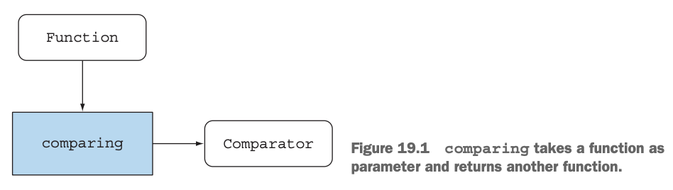
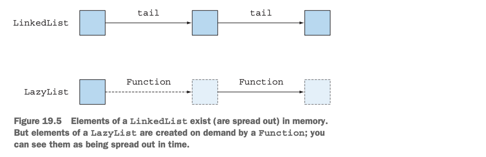

# 함수형 프로그래밍 기법
고급적인 함수형 프로그래밍 기법을 소개한다. 학술적 지식뿐만아니라 실무에 적욜할수 있는 실용적 기법을 모두 배워본다. 
## 19.1 함수는 모든 곳에 존재한다. 
18장에서 **함수형 프로그래밍**이란 함수나 메서드가 수학의 함수처럼 동작함을, 즉 부작용없이 동작함을 의미했다.  
함수를 마치 일반값처럼 사용해 인수로 전달하거나, 결과로 반환받거나, 자료구조에 저장할수 있음을 의미한다.   
일반값처럼 취급할수 있는 함수를 **일급함수**라고한다.  
자바8에서는 ::연산자로 **메서드 참조**를 만들거나 람다 표현식으로 직접 함수값을 표현해서 메서드를 함수값으로 사용할 수 있다.
```java
Function<String, Integer> strToInt = Integer::parseInt;
```
### 고차원 함수
Comparator.comparing처럼 다음 중 하나 이상의 동작을 수행하는 함수를 고차원 함수라 부른다.
* 하나 이상의 함수를 인수로 받음
* 함수를 결과로 반환
> 
> comparing은 함수를 인수로 받아 다른 함수를 반환한다. 
> ```java
>  Comparator<Apple> c = comparing(Apple::getWeght);
> ```
스트림 연산과 마찬가지로 고차원 함수를 구현 시, 인수로 전달된 함수가 부작용을 포함할 가능성을 염두에 두어야 한다.


### 커링
함수를 모듈화하고 코드를 재사용하는데 도움을 주는 기법을 **커링**이라고 한다.
* 예제 
* _CtoF(x) = x*9/5 + 32_ (섭씨를 화씨로 변환하는 공식)
  * 다음과같은 패턴으로 단위를 표현할수 있다.
  1. 변환요소를 곱함
  2. 기준치 조정 요소를 적용
* **예제코드** : <a href="https://github.com/day0ung/ModernJavaInAction/blob/main/java_code/modern_java/src/chapter19/SourceCode191.java">SourceCode191</a>
```java
static double converter(double x, double f, double b) {
  return x * f + b;
}
//x: 변환하려는값, f: 변환요소, b: 기준치 조정요소
...
double gbp = converter(1000, 0.6, 0);

//커링을 활용한 팩토리로 정의
static DoubleUnaryOperator curriedConvergter(double f, double b) {
  return (double x) -> x * f + b;
}
...
DoubleUnaryOperator convertUSDtoGBP = curriedConvergter(0.6, 0);
double gbp = convertUSDtoGBP.applyAsDouble(1000);
```
> **커링의 이론적 정의**  
> 커링은 x와 y라는 두 인수를 받는 함수 f를 한 개의 인수를 받는 g라는 함수로 대체하는 기법이다.
> 이때 g라는 함수 역기 하나의 인수를 받는 함수를 반환한다. 이때 함수 g의 상태는 여러과정이 끝나지 않은 상태를 가리켜 '함수가 부분적으로(partially) 적용되었다'라고 말한다.
## 19.2 영속 자료구조
함수형 메서드에서는 전역 자료구조나 인수로 전달된 구조를 갱신할 수 없다.

자료 구조를 바꾼다면 같은 메서드를 두 번 호출했을 때 결과가 달라지면서 참조 투명성에 위배되고 인수를 결과로 단순하게 매핑할 수 있는 능력이 상실되기 때문이다.
#### 파괴적인 갱신과 함수형
자료구조를 갱신할때 발생할 수있는 문제를 확인해보자  
* 예제
* A에서 B까지 기차여행을 의미하는 **가변** TrainJourney클래스가 있다고 가정
* TrainJourney는 간단한 단방향 연결리스트로 구현되며 여행 구간의 가격등 상세 정보를 포함하는 int필드를 포함
* 기차여행에서는 TrainJourney객체를 연결할수 있는 onword(이어지는 여정이라는의미)필드가 필요하다
* 직통열차나 여정의 마지막 구간에서는 onward가 null이된다. 
* **예제코드** : <a href="https://github.com/day0ung/ModernJavaInAction/blob/main/java_code/modern_java/src/chapter19/SourceCode1921.java">SourceCode1921</a>

```java
static TrainJourney link(TrainJourney a, TrainJourney b) {
  if (a == nul) return b;
  
  TrainJourney t= a;
  while(t.onward != null) {
    t = t.onward;
  }
  t.onward =b;
  return a;
}

```
위의 함수 link()가 수행되면 a의 값까지 갱신시켜버린다. 기존에 a를 참조하던 영역에서 문제가 생길 수 있다.
```java
static TrainJourney append(TrainJourney a, TrainJourney b) {
  retun a == null ? b : new TrainJourney(a.price, append(a.onward, b));
}
```
위 코드는 기존 자료구조를 변경하지 않는다. 하지만 기존 a와 b가 바뀐다면 함께 갱신되므로 주의해야 한다.

#### 트리를 사용한 다른 예제
HashMap같은 인터페이스를 구현할 때는 이진탐색트리가 사용된다. 
* 예제
* Tree는 문자열 키와 int값을 포함한다. 
* 이진 탐색 트리를 이용해서 문자열값으로 int를얻을수 있다. 주어진 키와 연관된 값을 갱신해보자

```java
//Tree(key, val, left, right);

public static Tree update(String key, int newval, Tree t) {
  if (t == null)
    t = new Tree(key, newval, null, null);
  else if (key.equal(t.key))
    t.val = newval;
  else if (key.compareTo(t.key) < 0)
    t.left = update(key, newval, t.left);
  else
    t.right = update(key, newval, t.right);
  return t;
}
```
두 가지 update 버전 모두 기존 트리를 변경하고 트리에 저장된 맵의 모든 사용자가 변경에 영향을 받는다.
#### 함수형 접근법 사용
```java
public static Tree fupdate(String key, int newval, Tree t) {
  if (t == null) ?
    new Tree(key, newval, null, null) :
      k.equals(t.key) ?
        new Tree(key, newval, t.left, t.right) :
      k.compareTo(t.key) < 0 ?
        new Tree(t.key, t.val, fupdate(key, newval, t.left), t.right) :
        new Tree(t.key, t.val, t.left, fupdate(key, newval, t.right));
}
```
부작용 없는 하나의 표현식임을 강조하기 위해 하나의 조건문을 사용했지만, if-then-else 문으로 코드를 구현할 수도 있다.

fupdate를 호출하면 기존의 트리를 갱신하는 것이 아니라 새로운 노드를 만든다. 따라서 기존 자료구조에는 영향을 미치지 않는다

## 19.3 스트림과 게으른 평가
스트림은 한 번만 소비할 수 있다는 제약이 있어서 재귀적으로 정의할 수 없다.
이 제약 때문에 발생하는 문제들을 살펴보자.
### 자기 정의 스트림
소수를 생성하는 예제 코드로 재귀 스트림을 살펴보자
```java
public static Stream<Integer> primes(int n) {
  return Stream iterate(2, i -> i + 1)
    .filter(MyMathUtil::isPrime)
    .limit(n);
}

public static boolean isPrime(int candidate) {
  int candidateRoot = (int) Math.sqrt((double) candidate);
  return IntStream.rangeClosed(2, candidateRoot)
    .noneMatch(i -> candidate % i == 0);
}
```
후보 수로 정확히 나누어 떨어지는지 매번 모든 수를 반복 확인한다.  
또한 합성 수(소수로 나눌 수 있는 수)는 제외할 수 있다.  
다음은 합성수를 제외하는 과정이다.

1. 소수를 선택할 숫자 스트림이 필요하다.
2. 스트림에서 첫 번째 수(스트림의 head)를 가져온다. 이 숫자는 소수다.
3. 이제 스트림의 tail에서 가져온 수로 나누어떨어지는 모든 수를 걸러 제외시킨다.
4. 이렇게 남은 숫자만 포함하는 새로운 스트림에서 소수를 찾는다. 1부터 재귀적으로 호출한다.

스트림 API로 이알고리즘을 구현해보자
* 1단계: 스트림 숫자얻기
  * ```java
    static Intstream numbers() {
       return Intstream.iterate(2, n -> n +1);
    }
    ``` 
* 2단계: 머리 획득
  * ```java
    Static int head(IntStream numbers) {
       return numbers.findFirst().getAsInt();
    }
    ```
* 3단계: 꼬리 필터링
   * ```java
     Static IntStraem tail(IntStream numbers) {
       return numbers.skip(1);
       }

     IntStream numbers = numbers();
     int head = head(numbers);
     IntStream filtered = tail(numbers).filter(n -> n % head != 0);
     ``` 
* 4단계: 재귀적으로 소수 스트림 생성
   * ```java
     static IntStream primes(IntStream numbers) {
        int head = head(numbers);
        return intStream.concat(
           IntStream.of(head),
           primes(tail(numbers).filter(n -> n % head != 0)
        );
     }
     ``` 
  
* 나쁜소식
   *   4 단계 코드를 실행하면 에러가 발생한다. 앞서 스트림을 머리와 꼬리로 분리하면서 최종연산인 findFirst와 skip을 사용했다. 최종연산을 호출하면 스트림은 완전히 소비된다. 
* 게으른 평가
   * 더 심각한 문제가 있다. IntStream.concat은 두 개의 스트림 인스턴스를 인수로 받는다. 두 번째 인수가 primes를 직접 재귀적으로 호출하면서 무한 재귀에 빠진다.

이 문제를 해결하기 위해서는 primes를 게으르게 평가해야한다. 

### 게으른 리스트 만들기
자바 8의 스트림은 게으르다. 요청할 때만 값을 생성하는 블랙박스와 같다. 스트림에 일련의 연산을 적용하면 연산이 수행되지 않고 일다 저장된다.  
스트림에 **최종연산**을 적용해서 실제 계산을 해야하는 상황에서만 실제 연산이 이루어진다.  

LinkedList의 요소는 메모리에 존재한다. 하지만 LazyList의 요소는 Function이 요청해야 생성된다. 
아래에서 게으른 리스트가 실제로 동작하는 모습을 살펴보자
* 기본적인 연결리스트
* 기본적인 게으른 리스트
* 소수 생성으로 돌아와서
* 게으른 필터 구현
* **예제코드** : <a href="https://github.com/day0ung/ModernJavaInAction/blob/main/java_code/modern_java/src/chapter19/SourceCode193.java">SourceCode193</a>

## 19.4 패턴 매칭
패턴 매칭은 함수형 프로그래밍을 구분하는 또 하나의 중요한 특징이다. (정규표현식의 패턴매칭과는 다르다)
수학에서는 다음과 같은 정의를 할수 있다. 
* f(0) = 1
* f(n) = n*f(n-1) 그렇지 않으면 

자바에서는 if-then-else나 switch문을 사용해야한다. 자료형이 복잡해지면서 이러한 작업을 처리하는데 필요한 코드의 양이 증가했다.  
이러한 불필요한 코드들을 패턴 매칭을 사용해 줄일수 있다. 
### 방문자 디자인 패턴
방문자 디자인 패턴을 사용하면 자료형을 언랩할 수 있으며, 특정 데이터 형식을 '방문'하는 알고리즘을 캡슐화할 수 있다.

방문자 클래스는 지정된 데이터 형식의 인스턴스를 입력으로 받고, 인스턴스의 모든 멤버에 접근한다.
```java
class BinOp extends Expr {
  ...
  public Expr accept(SimpiftExprVisitor v) {
    return v.visit(this);
  }
}

public class SimpiftExprVisitor {
   ...
   public Expr visit(BinOp e) {
     if("+".equal(e.opname) && e.right instanceof Number && ...) {
       return e.left;
     }
     return e;
   }
 }
```
### 패턴 매칭의 힘
자바는 패턴 매칭을 지원하지 않으므로 스칼라 프로그래밍 언어에서는 패턴 매칭을 사용해 간결하고 명확한 코드를 구현할 수 있다.
```scala
def simplifyExpression(expr: Expr): Expr = expr match {
  case BinOp("+", e, Number(0)) => e  //0 더하기
  case BinOp("*", e, Number(1)) => e  //1 곱하기
  case BinOp("/", e, Number(1)) => e  //1 나누기
  case _ => expr //expr을 단순화할 수 없다.
}
// 패턴 매칭을 지원하는 언어의 가장 큰 실용적인 장점은 커다란 switch 문이나 if-then-else 문을 피할 수 있다는 것이다.
```

## 19.5 기타 정보
#### 캐싱 또는 기억화
참조 투명성이 유지되는 상황이라면 기억화를 이용하여 추가 오버헤드를 피할 수 있다. 기억화는 메서드에 래퍼로 캐시를 추가하는 기법이다.
#### '같은 객체를 반환함'은 무엇을 의미하는가
참조 투명성은 '인수가 같다면 결과도 같아야 한다'라는 규칙을 만족해야 한다. 하지만 논리적으로 같은 데이터이나 같은 참조를 갖지 않으면 서로 다른참조이므로 == 연산이 성립되지 않는다. 그러나 자료구조를 변경하지 않는 상황에서 참조가 다르다는 것은 큰 의미가 없으며 논리적으로 같기에, 함수형 프로그래밍에서는 구조적인 값이 같다면 둘은 같은 객체라고 할 수 있다.
#### 콤비네이터
함수형 프로그래밍에선 함수를 인자로 받고 조합하며 결과로 함수를 반환하는 형식의 고차원 함수를 많이 사용하게 된다. 이처럼 함수를 조합하는 기능을 콤비네이터라고 부른다.